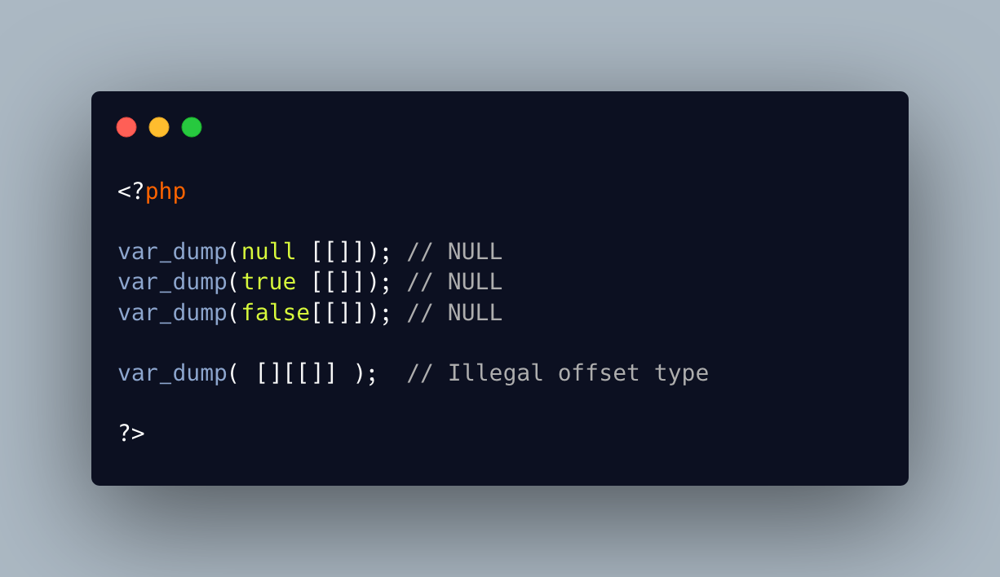

.. _null-or-boolean-as-array:

null Or Boolean As Array
------------------------

	.. meta::
		:description lang=en:
			null Or Boolean As Array: Null and booleans support the array syntax, but always return NULL as value.

Null and booleans support the array syntax, but always return NULL as value. Since PHP 7.4, they also report a warning, as this is not good code.

Arrays also report errors when the key type is not valid, such as another array or an object.

Interestingly, Null and boolean accept illegal keys, with a simple warning.

