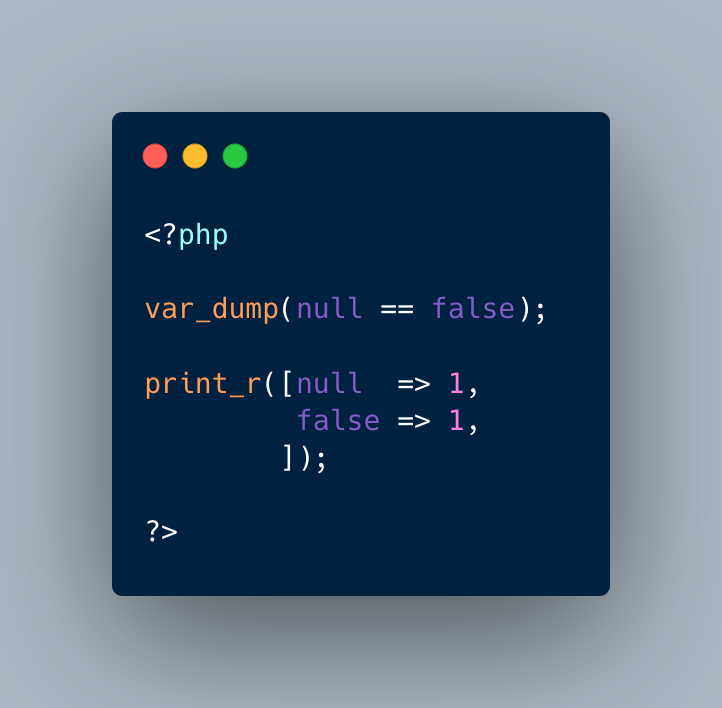

.. _null-does-not-always-equal-false:

null Does Not Always Equal false
--------------------------------

.. meta::
	:description:
		null Does Not Always Equal false: null equals false, so the first equality is actually true.
	:twitter:card: summary_large_image
	:twitter:site: @exakat
	:twitter:title: null Does Not Always Equal false
	:twitter:description: null Does Not Always Equal false: null equals false, so the first equality is actually true
	:twitter:creator: @exakat
	:twitter:image:src: https://php-tips.readthedocs.io/en/latest/_images/null_equal_false.png
	:og:image: https://php-tips.readthedocs.io/en/latest/_images/null_equal_false.png
	:og:title: null Does Not Always Equal false
	:og:type: article
	:og:description: null equals false, so the first equality is actually true
	:og:url: https://php-tips.readthedocs.io/en/latest/tips/null_equal_false.html
	:og:locale: en

.. raw:: html

	

null equals false, so the first equality is actually true.

On the other hand, using null and false as keys in an array, lead them to be cast to string: they end up being different, and that allows two elements to be stored in the array.

See Also
________

* `null and false are in an array <https://3v4l.org/av7e9>`_

