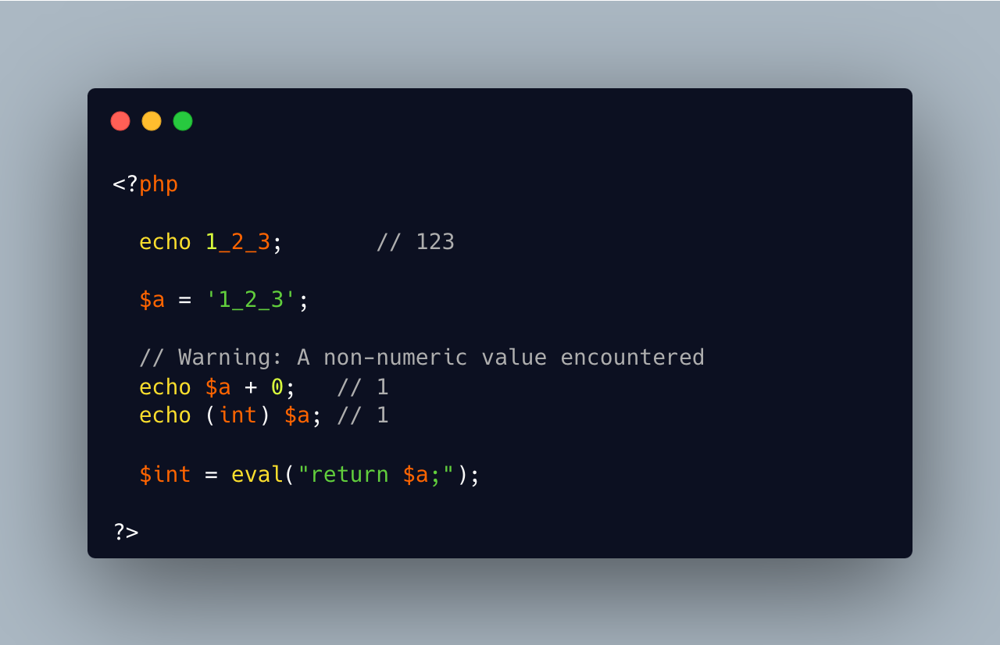

.. _numeric-separators-inside-a-string?:

Numeric Separators Inside A String?
-----------------------------------

.. meta::
	:description:
		Numeric Separators Inside A String?: Since PHP 7.
	:twitter:card: summary_large_image
	:twitter:site: @exakat
	:twitter:title: Numeric Separators Inside A String?
	:twitter:description: Numeric Separators Inside A String?: Since PHP 7
	:twitter:creator: @exakat
	:twitter:image:src: https://php-tips.readthedocs.io/en/latest/_images/numeric_separator_string.png
	:og:image: https://php-tips.readthedocs.io/en/latest/_images/numeric_separator_string.png
	:og:title: Numeric Separators Inside A String?
	:og:type: article
	:og:description: Since PHP 7
	:og:url: https://php-tips.readthedocs.io/en/latest/tips/numeric_separator_string.html
	:og:locale: en

.. raw:: html

	

Since PHP 7.4, there are numeric separators, to make integers more readable. 

They are only for hard-coded literals, so what do you do if you have stored them in a string ?

The solution is to rely on eval(), with a trick : ``$int = eval('return '.$a.';');``. ``return`` is important to return the value that was generated by the code.

Another option is to remove the _ chars, and cast the value to int.

See Also
________

* `Integers: syntax (PHP manual) <https://www.php.net/manual/en/language.types.integer.php#language.types.integer.syntax>`_
* `Eval <https://www.php.net/manual/en/function.eval.php>`_
* `strtr() <https://www.php.net/manual/fr/function.strtr.php>`_

PHP Features
____________

* `integer <https://php-dictionary.readthedocs.io/en/latest/dictionary/integer.ini.html>`_

* `numeric-separator <https://php-dictionary.readthedocs.io/en/latest/dictionary/numeric-separator.ini.html>`_

* `dynamic-call <https://php-dictionary.readthedocs.io/en/latest/dictionary/dynamic-call.ini.html>`_

