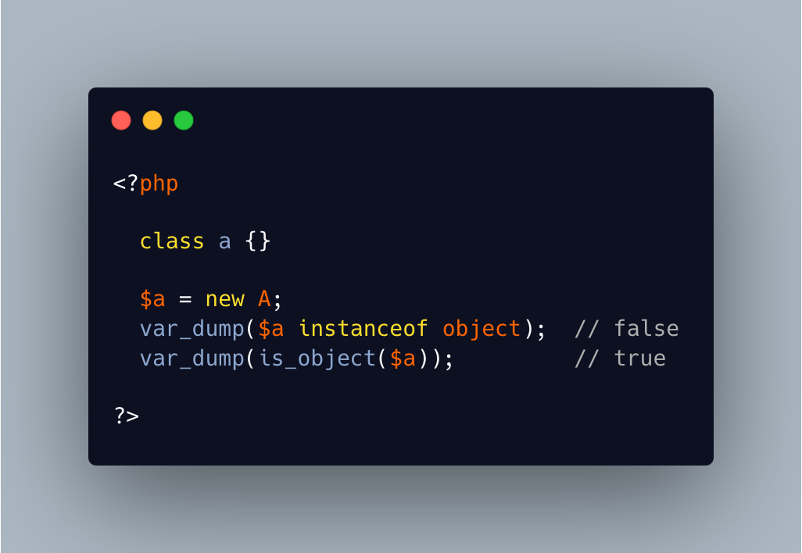

.. _object-is-not-a-type:

Object Is Not A Type
--------------------

.. meta::
	:description:
		Object Is Not A Type: Such situations always make me smile, yet I am certain several of us will loose time on such a mistake.
	:twitter:card: summary_large_image.
	:twitter:site: @exakat.
	:twitter:title: Object Is Not A Type.
	:twitter:description: Object Is Not A Type: Such situations always make me smile, yet I am certain several of us will loose time on such a mistake.
	:twitter:creator: @exakat.
	:twitter:image:src: https://php-tips.readthedocs.io/en/latest/_images/object_is_not_a_type.png.png.
	:og:image: https://php-tips.readthedocs.io/en/latest/_images/object_is_not_a_type.png.png.
	:og:image: Object Is Not A Type: Such situations always make me smile, yet I am certain several of us will loose time on such a mistake.

Such situations always make me smile, yet I am certain several of us will loose time on such a mistake. It is a bit more obvious with integer or string in the instanceof.

* `Variables (PHP manual) <https://www.php.net/manual/en/language.variables.php>`_

