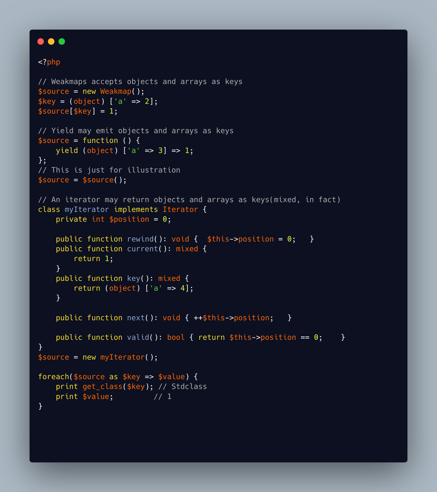

.. _objects-as-keys-in-foreach:

Objects As Keys In Foreach
--------------------------

.. meta::
	:description:
		Objects As Keys In Foreach: foreach() usually works on arrays, where the keys are either integer or strings.
	:twitter:card: summary_large_image
	:twitter:site: @exakat
	:twitter:title: Objects As Keys In Foreach
	:twitter:description: Objects As Keys In Foreach: foreach() usually works on arrays, where the keys are either integer or strings
	:twitter:creator: @exakat
	:twitter:image:src: https://php-tips.readthedocs.io/en/latest/_images/objects_as_keys.png
	:og:image: https://php-tips.readthedocs.io/en/latest/_images/objects_as_keys.png
	:og:title: Objects As Keys In Foreach
	:og:type: article
	:og:description: foreach() usually works on arrays, where the keys are either integer or strings
	:og:url: https://php-tips.readthedocs.io/en/latest/tips/objects_as_keys.html
	:og:locale: en

.. raw:: html

	

foreach() usually works on arrays, where the keys are either integer or strings. Not null, boolean anymore, but, more importantly, no array or objects. Yet, there are three solutions to make an object appear as the key, instead of the value (or also as the value).

The first option is to use a Weakmap object, which uses the array syntax, and accepts anything as keys.

Then, you can use a generator, ``yield``ing any type on the ``=>`` operators, left and right. Note that it won't work with ``yield from`` which requires an array.

Finally, you can use an interator, which has a dedicated method ``key``, with a return type of ``mixed``.

While it is not common in PHP, there are other languages which accepts such structures, and may hand it to PHP for further processing.

See Also
________

* `WeakMap (PHP manual) <https://www.php.net/manual/en/class.weakmap.php>`_

PHP Error Messages
__________________

* `Object of class %s could not be converted to string <https://php-errors.readthedocs.io/en/latest/messages/object-of-class-%25s-could-not-be-converted-to-string.html>`_

PHP Features
____________

* `object <https://php-dictionary.readthedocs.io/en/latest/dictionary/object.ini.html>`_

* `yield <https://php-dictionary.readthedocs.io/en/latest/dictionary/yield.ini.html>`_

* `weakmap <https://php-dictionary.readthedocs.io/en/latest/dictionary/weakmap.ini.html>`_

* `array <https://php-dictionary.readthedocs.io/en/latest/dictionary/array.ini.html>`_

