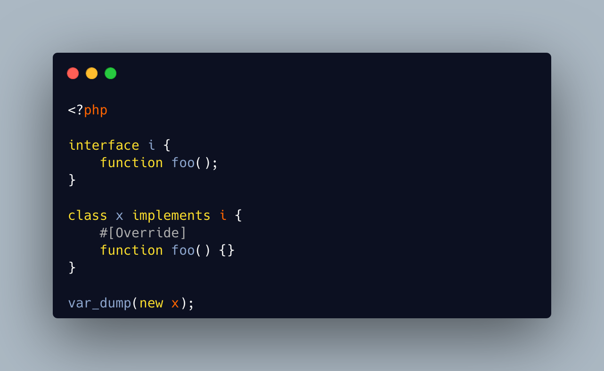

.. _override-with-interface:

Override With Interface
-----------------------

.. meta::
	:description:
		Override With Interface: The override attribute checks that a method is actually overriding a parent definition of the same method: this implides that a class must have a parent to use the Override attribute.
	:twitter:card: summary_large_image
	:twitter:site: @exakat
	:twitter:title: Override With Interface
	:twitter:description: Override With Interface: The override attribute checks that a method is actually overriding a parent definition of the same method: this implides that a class must have a parent to use the Override attribute
	:twitter:creator: @exakat
	:twitter:image:src: https://php-tips.readthedocs.io/en/latest/_images/override_with_interface.png
	:og:image: https://php-tips.readthedocs.io/en/latest/_images/override_with_interface.png
	:og:title: Override With Interface
	:og:type: article
	:og:description: The override attribute checks that a method is actually overriding a parent definition of the same method: this implides that a class must have a parent to use the Override attribute
	:og:url: https://php-tips.readthedocs.io/en/latest/tips/override_with_interface.html
	:og:locale: en

.. raw:: html

	

The override attribute checks that a method is actually overriding a parent definition of the same method: this implides that a class must have a parent to use the Override attribute.

There is a special case, which is a class without a parent, though implementing an interface. The Override attribute may be used on any of the interface method, though the class has no parent.

See Also
________

* `More about the Override Attribute <https://www.exakat.io/en/more-about-the-override-attribute/>`_
* `Override <https://www.php.net/manual/en/class.override.php>`_

