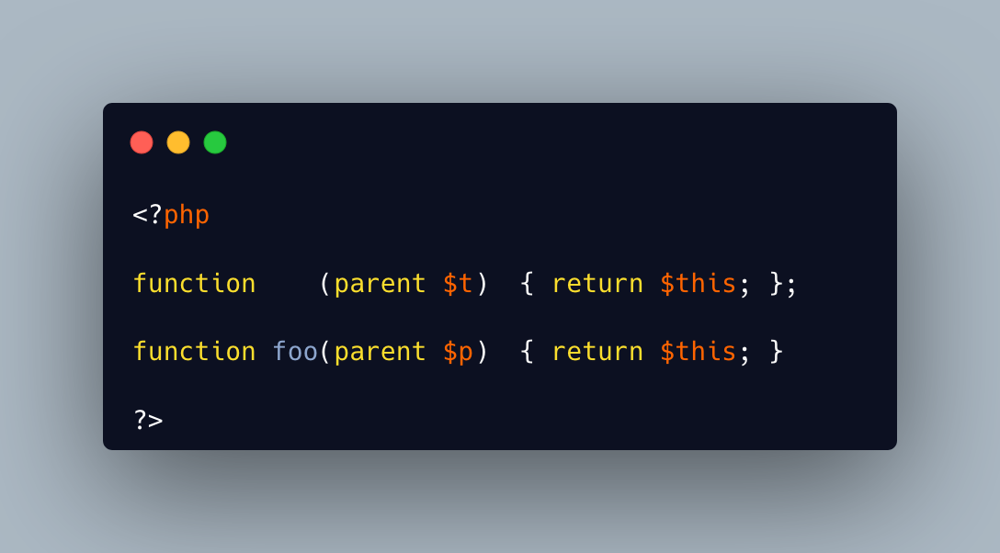

.. _parent-in-function:

parent In Function
------------------

.. meta::
	:description:
		parent In Function: ``parent`` shall only be inside a class, as it refers to the parent class.
	:twitter:card: summary_large_image
	:twitter:site: @exakat
	:twitter:title: parent In Function
	:twitter:description: parent In Function: ``parent`` shall only be inside a class, as it refers to the parent class
	:twitter:creator: @exakat
	:twitter:image:src: https://php-tips.readthedocs.io/en/latest/_images/parent_in_function.png
	:og:image: https://php-tips.readthedocs.io/en/latest/_images/parent_in_function.png
	:og:title: parent In Function
	:og:type: article
	:og:description: ``parent`` shall only be inside a class, as it refers to the parent class
	:og:url: https://php-tips.readthedocs.io/en/latest/tips/parent_in_function.html
	:og:locale: en

.. raw:: html

	

``parent`` shall only be inside a class, as it refers to the parent class. This does not happen with a function, so the second line in this example produces a Fatal Error.

It does not produce the same error with a Closure, or Arrow function. This is valid code because it is possible to change the underlying object of the closure, and give it a valid class to run it with. This is done with the ``Closure::call()`` and ``Closure::bindTo()`` methods.

The main problem, in this situation, is that such code is invalid a writing location, and becomes valid later, after some reconfiguration. Sometimes, static analysis finds it hard to track.

See Also
________

* `The Closure class (PHP manual) <https://www.php.net/manual/en/class.closure.php>`_
* `Calling parent on a closure <https://3v4l.org/QWeN7>`_ [Try me]

PHP Error Messages
__________________

* `Cannot use "parent" when no class scope is active <https://php-errors.readthedocs.io/en/latest/messages/cannot-use-%22parent%22-when-no-class-scope-is-active.html>`_

PHP Features
____________

* `class <https://php-dictionary.readthedocs.io/en/latest/dictionary/class.ini.html>`_

* `closure <https://php-dictionary.readthedocs.io/en/latest/dictionary/closure.ini.html>`_

* `function <https://php-dictionary.readthedocs.io/en/latest/dictionary/function.ini.html>`_

* `parent <https://php-dictionary.readthedocs.io/en/latest/dictionary/parent.ini.html>`_

