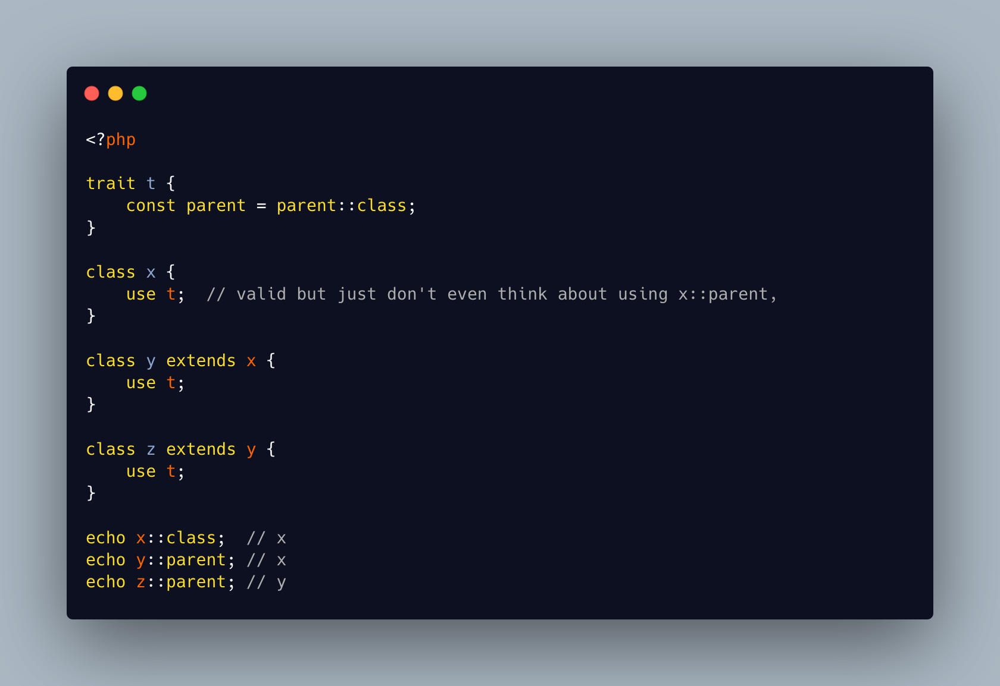

.. _::parent-operator:

::parent Operator
-----------------

.. meta::
	:description:
		::parent Operator: PHP provides the ``X::class`` operator to access a class's fully qualified name.
	:twitter:card: summary_large_image
	:twitter:site: @exakat
	:twitter:title: ::parent Operator
	:twitter:description: ::parent Operator: PHP provides the ``X::class`` operator to access a class's fully qualified name
	:twitter:creator: @exakat
	:twitter:image:src: https://php-tips.readthedocs.io/en/latest/_images/parent_operator.png
	:og:image: https://php-tips.readthedocs.io/en/latest/_images/parent_operator.png
	:og:title: ::parent Operator
	:og:type: article
	:og:description: PHP provides the ``X::class`` operator to access a class's fully qualified name
	:og:url: https://php-tips.readthedocs.io/en/latest/tips/parent_operator.html
	:og:locale: en

.. raw:: html

	

PHP provides the ``X::class`` operator to access a class's fully qualified name. To get the parent's class, one must use the ``get_parent_class()`` native function. Wouldn't it be cool to have the same operator?

To build that operator, we'll use a special trait ``t``: it defines a constant, build with ``parent::class``. This operator is the contrary to what we need, but it is the only situation where we use it. Note that ``parent`` is a valid constant, or method, name.

Note also that recent PHP versions do not accept a direct call to a trait, so it is not possible to call ``t::parent``, which has no parent.

The ``::parent`` will be case sensitive. The case insensitive versions of this operator is left as an exercise for the reader.

From there, any class that needs to use the ``::parent`` needs to ``use t;``. It is possible to ``use`` that trait in any class, but avoid calling the ``::parent`` operator on classes that have no parents.

The trick here is that ``z::parent`` actually calls the trait class, which, in turns, uses the ``parent`` relative class. Even ``parent::parent`` works, as the first one is the keyword, and the second one is the constant.

Make sure that each class ``use t``, as any unconfigured class will defer execution to its own parent, and return... a wrong value.

After ``::parent``, the ``::grandparent`` operator, based on the same strategy was tempting, and ... tried! Sadly, ``const grandparent = self::parent::parent;`` yields a ``(expression)::class cannot be used in constant expressions``, even when not used.

See Also
________

* `::parent operator <https://3v4l.org/4s7KM>`_ [Try me]

PHP Error Messages
__________________

* `(expression)::class cannot be used in constant expressions <https://php-errors.readthedocs.io/en/latest/messages/%28expression%29%3A%3Aclass-cannot-be-used-in-constant-expressions.html>`_

PHP Features
____________

* `trait <https://php-dictionary.readthedocs.io/en/latest/dictionary/trait.ini.html>`_

* `parent <https://php-dictionary.readthedocs.io/en/latest/dictionary/parent.ini.html>`_

* `const <https://php-dictionary.readthedocs.io/en/latest/dictionary/const.ini.html>`_

* `relaxed-syntax <https://php-dictionary.readthedocs.io/en/latest/dictionary/relaxed-syntax.ini.html>`_

