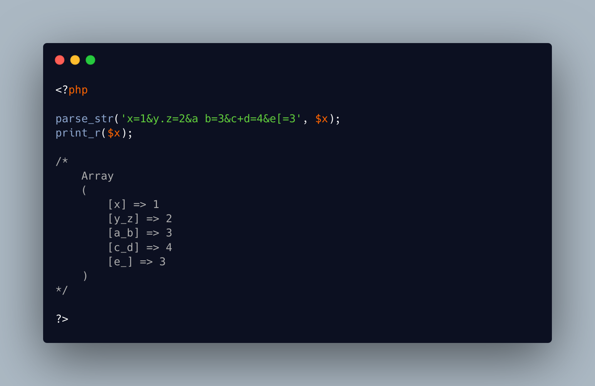

.. _parse_str()-edge-cases:

parse_str() Edge Cases
----------------------

.. meta::
	:description:
		parse_str() Edge Cases: parse_str() reads the variables in the URL's query string, and convert them into an array.
	:twitter:card: summary_large_image
	:twitter:site: @exakat
	:twitter:title: parse_str() Edge Cases
	:twitter:description: parse_str() Edge Cases: parse_str() reads the variables in the URL's query string, and convert them into an array
	:twitter:creator: @exakat
	:twitter:image:src: https://php-tips.readthedocs.io/en/latest/_images/parse_str_edge_cases.png
	:og:image: https://php-tips.readthedocs.io/en/latest/_images/parse_str_edge_cases.png
	:og:title: parse_str() Edge Cases
	:og:type: article
	:og:description: parse_str() reads the variables in the URL's query string, and convert them into an array
	:og:url: https://php-tips.readthedocs.io/en/latest/tips/parse_str_edge_cases.html
	:og:locale: en

.. raw:: html

	

parse_str() reads the variables in the URL's query string, and convert them into an array. When the variable names contain a dot ``.``, that dot is automagically converted to an underscore.

This happens with the ``dot``, but also other characters, such as `` `` (space), ``+`` (which is a space too), and a single opening ``[`` (when completed with a closing one, that variable becomes an array).

This is coming from previous versions of PHP, where these variables ended being converted into PHP variables. And the listed characters are actually forbidden in variable names. This is not a problem anymore, since PHP avoids creating variables that way, for security reasons. Yet, for backward compatibility reasons, these conversions are still in place.

See Also
________

* `parse_str (PHP manual) <https://www.php.net/manual/en/function.parse-str.php>`_
* `parse_str - replacing dot and space with underscore in keys <https://github.com/php/php-src/issues/8639>`_
* `Various parse_str() replacements <https://3v4l.org/4GMFX>`_ [Try me]

