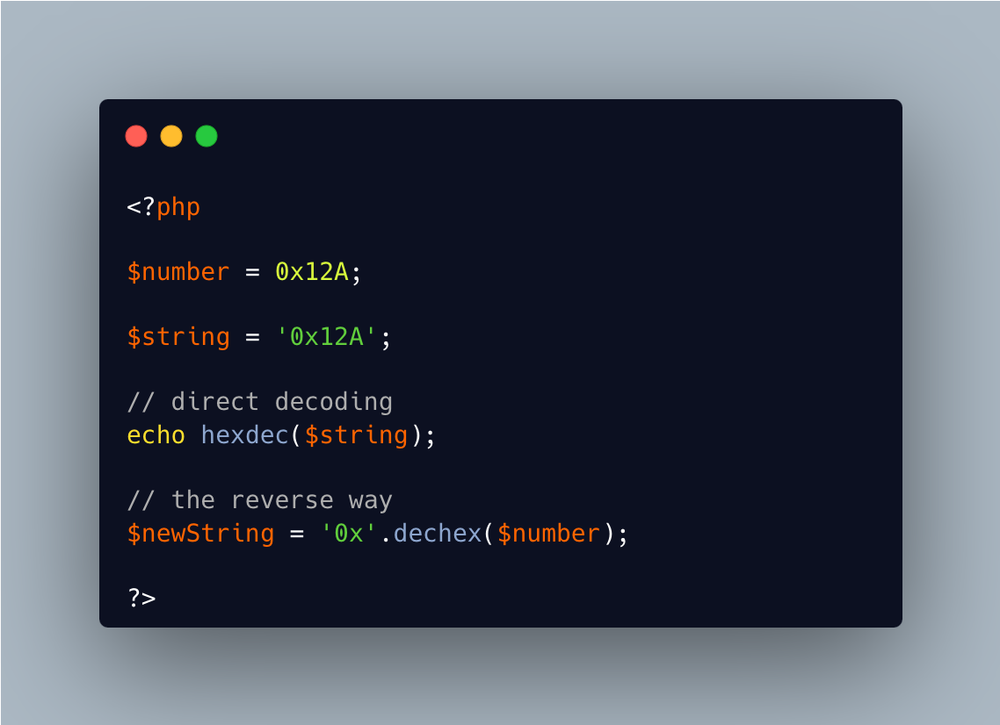

.. _php-integer-format:

PHP Integer Format
------------------

.. meta::
	:description:
		PHP Integer Format: PHP has several convenient integer format to write them in a proper way: 0x12F, 0b110101, 0o12367.
	:twitter:card: summary_large_image
	:twitter:site: @exakat
	:twitter:title: PHP Integer Format
	:twitter:description: PHP Integer Format: PHP has several convenient integer format to write them in a proper way: 0x12F, 0b110101, 0o12367
	:twitter:creator: @exakat
	:twitter:image:src: https://php-tips.readthedocs.io/en/latest/_images/php_integer_format.png
	:og:image: https://php-tips.readthedocs.io/en/latest/_images/php_integer_format.png
	:og:title: PHP Integer Format
	:og:type: article
	:og:description: PHP has several convenient integer format to write them in a proper way: 0x12F, 0b110101, 0o12367
	:og:url: https://php-tips.readthedocs.io/en/latest/tips/php_integer_format.html
	:og:locale: en

.. raw:: html

	

PHP has several convenient integer format to write them in a proper way: 0x12F, 0b110101, 0o12367. This works well as part of the code

When such formats are provided as a string, it may be processed with the ad hoc native functions such as hexdec(), bindec() or octdec() : they convert a number between bases, and they also accept the native PHP formats.

For the reverse operation, the reverse functions are also useful, with an extra header for the format.

* `Integer (PHP manual) <https://www.php.net/manual/en/language.types.integer.php>`_
* `hexdec <https://www.php.net/manual/fr/function.hexdec.php>`_
* `octdec <https://www.php.net/manual/fr/function.octdec.php>`_
* `bindec <https://www.php.net/manual/fr/function.bindec.php>`_
* `dechexdec <https://www.php.net/manual/fr/function.dechex.php>`_
* `decoctdec <https://www.php.net/manual/fr/function.decoct.php>`_
* `decbindec <https://www.php.net/manual/fr/function.decbin.php>`_

