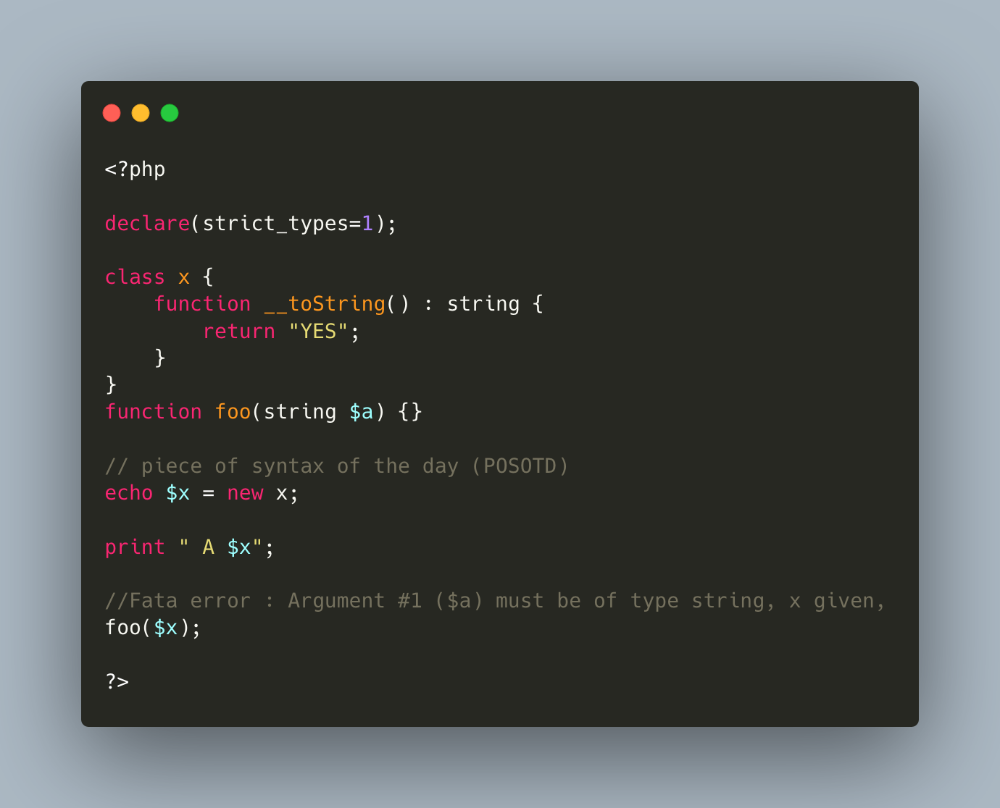

.. _inconsistent-constructor-signatures:

Inconsistent Constructor Signatures
-----------------------------------

PHP enforces that methods have the same signature in a parent class and in a children class. It raises a Fatal Error if not.

Unless for constructors, where the signatures can be different.

This exception to the rule is for legacy purposes, as many source code have varying signatures in a class hierarchy.

Yet, modern OOP recommends to synchronize those signatures, so has to allow instantiation using the same set of arguments.

* `Constructors and Destructors (PHP manual) <https://www.php.net/manual/en/language.oop5.decon.php>`_

