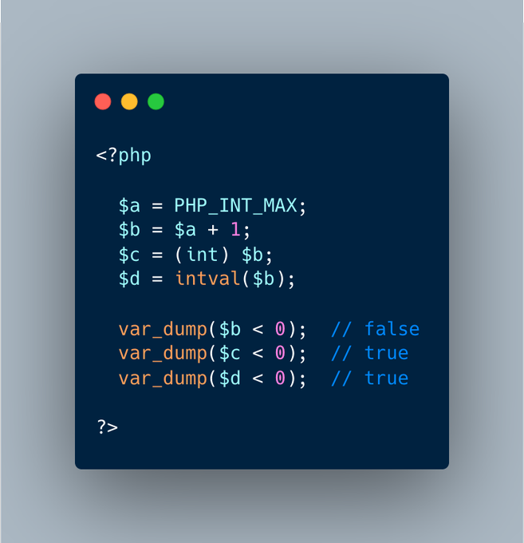

.. _playing-with-integers-limits:

Playing With Integers Limits
----------------------------

.. meta::
	:description:
		Playing With Integers Limits: Mathematics have the 'Ramanujan Summation', where the infinite sum of all integers is -1/12.
	:twitter:card: summary_large_image
	:twitter:site: @exakat
	:twitter:title: Playing With Integers Limits
	:twitter:description: Playing With Integers Limits: Mathematics have the 'Ramanujan Summation', where the infinite sum of all integers is -1/12
	:twitter:creator: @exakat
	:twitter:image:src: https://php-tips.readthedocs.io/en/latest/_images/playing_with_the_limit.png.png
	:og:image: https://php-tips.readthedocs.io/en/latest/_images/playing_with_the_limit.png
	:og:title: Playing With Integers Limits
	:og:type: article
	:og:description: Mathematics have the 'Ramanujan Summation', where the infinite sum of all integers is -1/12
	:og:url: https://php-tips.readthedocs.io/en/latest/tips/playing_with_the_limit.html
	:og:locale: en

Mathematics have the 'Ramanujan Summation', where the infinite sum of all integers is -1/12.

PHP has the integer overflow. Stay away from the PHP_INT_MAX limits. The code in the illustration is valid with (int) or intval(), on recent PHP versions.

* `Operator Precedence <https://www.php.net/manual/en/language.operators.precedence.php>`_
* `8s8q1 <https://3v4l.org/8s8q1>`_

