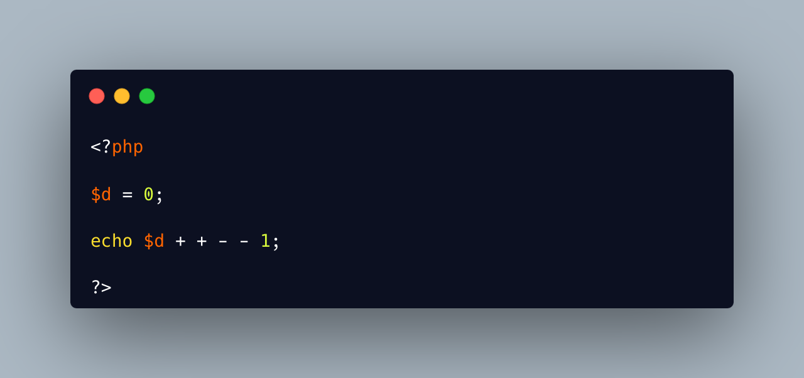

.. _plus-plus-minus-minus:

Plus Plus Minus Minus
---------------------

.. meta::
	:description:
		Plus Plus Minus Minus: What does a separated list of plus and minus do to a literal.
	:twitter:card: summary_large_image
	:twitter:site: @exakat
	:twitter:title: Plus Plus Minus Minus
	:twitter:description: Plus Plus Minus Minus: What does a separated list of plus and minus do to a literal
	:twitter:creator: @exakat
	:twitter:image:src: https://php-tips.readthedocs.io/en/latest/_images/plus_plus_minus_minus.png
	:og:image: https://php-tips.readthedocs.io/en/latest/_images/plus_plus_minus_minus.png
	:og:title: Plus Plus Minus Minus
	:og:type: article
	:og:description: What does a separated list of plus and minus do to a literal
	:og:url: https://php-tips.readthedocs.io/en/latest/tips/plus_plus_minus_minus.html
	:og:locale: en

.. raw:: html

	

What does a separated list of plus and minus do to a literal? They will be merged independently in the literal. Here, two negations will make a positive, so we get a plus.

Don't forget the space between the plus and minus, or it will be a post increment operator, and a different answer.

See Also
________

* `plus plus <https://3v4l.org/4m7rI>`_ [Try me]

PHP Features
____________

* `operator <https://php-dictionary.readthedocs.io/en/latest/dictionary/operator.ini.html>`_

