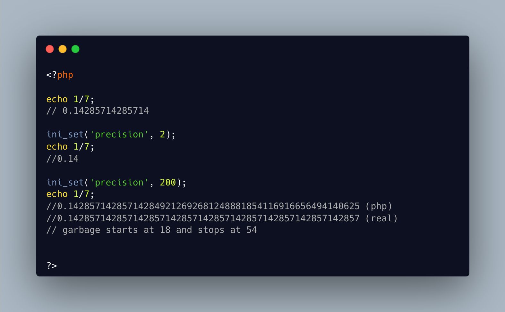

.. _float-precision:

Float Precision
---------------

.. meta::
	:description:
		Float Precision: PHP has a 'precision' directive that controls the number of decimals displayed by float values.

PHP has a 'precision' directive that controls the number of decimals displayed by float values. This is used with echo (and co), but also with cast to string. 

It default to 14, and peaks at 18, and gives up at 54. Use gmp for large numbers. 

When changing it, don't forget to reset it to default, unless you like to puzzle people.

* `precision (PHP manual) <https://www.php.net/manual/en/ini.core.php#ini.precision>`_

