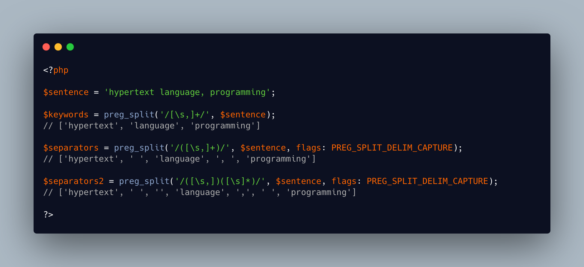

.. _preg_split()-magic:

preg_split() Magic
------------------

.. meta::
	:description:
		preg_split() Magic: Most of the time, explode() is sufficient to split a string with a static separator.
	:twitter:card: summary_large_image
	:twitter:site: @exakat
	:twitter:title: preg_split() Magic
	:twitter:description: preg_split() Magic: Most of the time, explode() is sufficient to split a string with a static separator
	:twitter:creator: @exakat
	:twitter:image:src: https://php-tips.readthedocs.io/en/latest/_images/preg_split.png
	:og:image: https://php-tips.readthedocs.io/en/latest/_images/preg_split.png
	:og:title: preg_split() Magic
	:og:type: article
	:og:description: Most of the time, explode() is sufficient to split a string with a static separator
	:og:url: https://php-tips.readthedocs.io/en/latest/tips/preg_split.html
	:og:locale: en

.. raw:: html

	

Most of the time, explode() is sufficient to split a string with a static separator. Otherwise, there is preg_split().

preg_split() uses a regex to split the string. This allows for multiple and complex separators to be used in the same call.

preg_split() accepts empty regex, to split strings with nothing: it turns a string into an array. It might require the PREG_SPLIT_NO_EMPTY option, to avoid trailing elements.

preg_split() has a PREG_SPLIT_DELIM_CAPTURE option, to collect the separators along the parsing. Since it might be complex, it is important to get them for further processing.

preg_split(), just like explode(), has a limit parameter, to stop processing the string, once a number of string has been found. This is perfect to prevent PHP from processing too much, as long as a number of expected strings can be predicted.

``explode()`` is faster ``preg_split()``, so use it for the simple and most common cases.

See Also
________

* `preg_split (PHP manual) <https://www.php.net/manual/en/function.preg-split.php>`_
* `explode (PHP manual) <https://www.php.net/manual/en/function.explode.php>`_
* `strtok (PHP manual) <https://www.php.net/manual/en/function.strtok.php>`_
* `preg_split magic <https://3v4l.org/32S4H>`_ [Try me]

PHP Error Messages
__________________

* `Argument #1 must not be empty <https://php-errors.readthedocs.io/en/latest/messages/must-not-be-empty.html>`_

PHP Features
____________

* `preg_split <https://php-dictionary.readthedocs.io/en/latest/dictionary/preg_split.ini.html>`_

* `explode <https://php-dictionary.readthedocs.io/en/latest/dictionary/explode.ini.html>`_

* `regex <https://php-dictionary.readthedocs.io/en/latest/dictionary/regex.ini.html>`_

