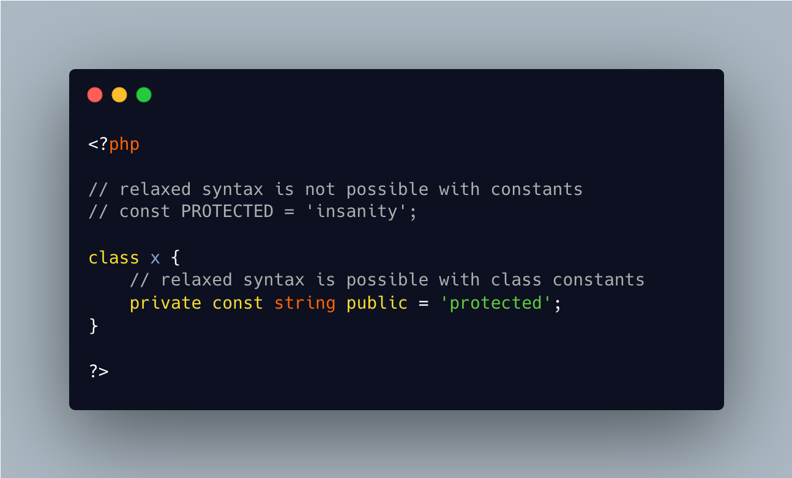

.. _private-is-relaxed:

private Is Relaxed
------------------

.. meta::
	:description:
		private Is Relaxed: PHP has the relaxed syntax since early 7.
	:twitter:card: summary_large_image
	:twitter:site: @exakat
	:twitter:title: private Is Relaxed
	:twitter:description: private Is Relaxed: PHP has the relaxed syntax since early 7
	:twitter:creator: @exakat
	:twitter:image:src: https://php-tips.readthedocs.io/en/latest/_images/private_is_relaxed.png
	:og:image: https://php-tips.readthedocs.io/en/latest/_images/private_is_relaxed.png
	:og:title: private Is Relaxed
	:og:type: article
	:og:description: PHP has the relaxed syntax since early 7
	:og:url: https://php-tips.readthedocs.io/en/latest/tips/private_is_relaxed.html
	:og:locale: en

.. raw:: html

	

PHP has the relaxed syntax since early 7.0, which allows usage of PHP keywords for methods and class constant names.

``private``, ``protected`` and ``public`` were forgotten until PHP 8.2: this is now fixed, and this beauty is now possible.

As usual, use with caution.

See Also
________

* `private as a public constant <https://3v4l.org/XYmck>`_ [Try me]

PHP Features
____________

* `exponential <https://php-dictionary.readthedocs.io/en/latest/dictionary/exponential.ini.html>`_

