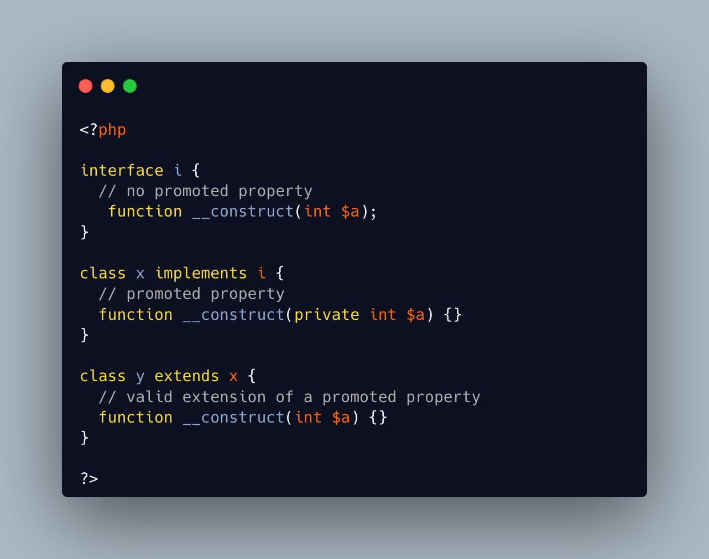

.. _promoted-properties-compatibility:

Promoted Properties Compatibility
---------------------------------

.. meta::
	:description:
		Promoted Properties Compatibility: Promoted properties are defined in a constructor signature.
	:twitter:card: summary_large_image
	:twitter:site: @exakat
	:twitter:title: Promoted Properties Compatibility
	:twitter:description: Promoted Properties Compatibility: Promoted properties are defined in a constructor signature
	:twitter:creator: @exakat
	:twitter:image:src: https://php-tips.readthedocs.io/en/latest/_images/promoted_compatibility.png
	:og:image: https://php-tips.readthedocs.io/en/latest/_images/promoted_compatibility.png
	:og:title: Promoted Properties Compatibility
	:og:type: article
	:og:description: Promoted properties are defined in a constructor signature
	:og:url: https://php-tips.readthedocs.io/en/latest/tips/promoted_compatibility.html
	:og:locale: en

.. raw:: html

	

Promoted properties are defined in a constructor signature. They cannot be defined in an abstract method, so they are not allowed in an abstract constructor: this is true in an abstract class and in an interface.

On the other hand, it is allowed to extend promoted properties without the promotion, and vice versa.

See Also
________

* `Class Abstract (PHP manual) <https://www.php.net/manual/en/language.oop5.abstract.php>`_
* `Promoting and compatibility <https://3v4l.org/KUlk3>`_ [Try me]

