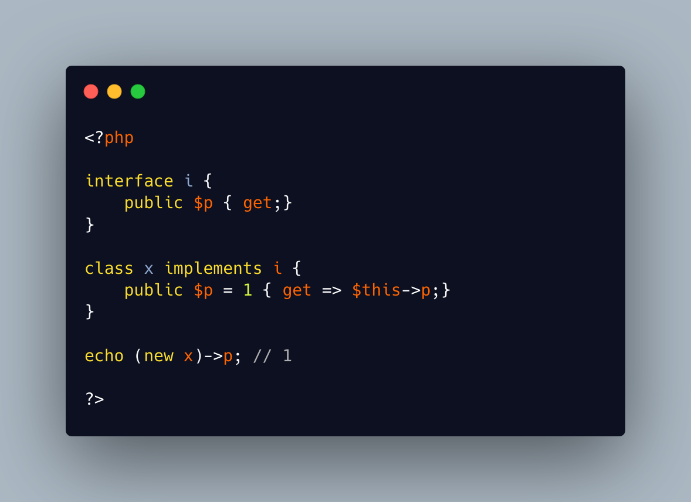

.. _properties-in-interfaces:

Properties In Interfaces
------------------------

.. meta::
	:description:
		Properties In Interfaces: Since PHP 8.
	:twitter:card: summary_large_image
	:twitter:site: @exakat
	:twitter:title: Properties In Interfaces
	:twitter:description: Properties In Interfaces: Since PHP 8
	:twitter:creator: @exakat
	:twitter:image:src: https://php-tips.readthedocs.io/en/latest/_images/property_in_interface.png
	:og:image: https://php-tips.readthedocs.io/en/latest/_images/property_in_interface.png
	:og:title: Properties In Interfaces
	:og:type: article
	:og:description: Since PHP 8
	:og:url: https://php-tips.readthedocs.io/en/latest/tips/property_in_interface.html
	:og:locale: en

.. raw:: html

	

Since PHP 8.4, it is possible to have properties in an interface.

In fact, one must add a property to a property. Since this is an interface, that hook cannot have a body.

Hence, the hook has to be defined in every implementing class.

See Also
________

* `Object Interfaces <https://www.php.net/manual/en/language.oop5.interfaces.php>`_
* `Property Hooks <https://www.php.net/manual/en/language.oop5.property-hooks.php>`_
* `Properties In Interfaces <https://3v4l.org/U4AZH>`_ [Try me]

PHP Features
____________

* `promoted-property <https://php-dictionary.readthedocs.io/en/latest/dictionary/promoted-property.ini.html>`_

* `interface <https://php-dictionary.readthedocs.io/en/latest/dictionary/interface.ini.html>`_

