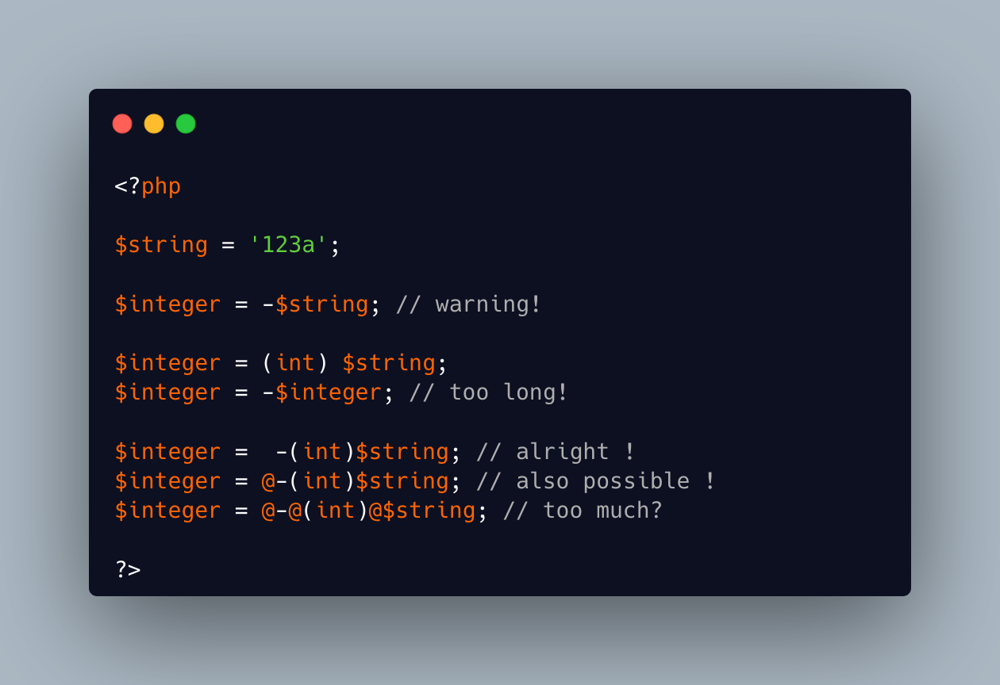

.. _where-to-put-the-cast?:

Where To Put The Cast?
----------------------

.. meta::
	:description:
		Where To Put The Cast?: Start from a string, and turn it into a negative number.
	:twitter:card: summary_large_image
	:twitter:site: @exakat
	:twitter:title: Where To Put The Cast?
	:twitter:description: Where To Put The Cast?: Start from a string, and turn it into a negative number
	:twitter:creator: @exakat
	:twitter:image:src: https://php-tips.readthedocs.io/en/latest/_images/put_the_cast_where.png
	:og:image: https://php-tips.readthedocs.io/en/latest/_images/put_the_cast_where.png
	:og:title: Where To Put The Cast?
	:og:type: article
	:og:description: Start from a string, and turn it into a negative number
	:og:url: https://php-tips.readthedocs.io/en/latest/tips/put_the_cast_where.html
	:og:locale: en

.. raw:: html

	

Start from a string, and turn it into a negative number. It is actually as simple as adding the ``-`` sign in front of the string.

But that might generate a warning, upon non-numeric string. So, the safe way is to cast the string to ``(int)``, and then, take the opposite.

Now, this is safe, but too long. In fact, this can be shortened by adding the ``(int)`` between the string and the sign, to cast first, then negate.

And, of course, one may also add the noscream operator.

See Also
________

* `cast and sign <https://3v4l.org/m6F8G>`_ [Try me]

PHP Error Messages
__________________

* `A non-numeric value encountered <https://php-errors.readthedocs.io/en/latest/messages/a-non-numeric-value-encountered.html>`_

PHP Features
____________

* `minus <https://php-dictionary.readthedocs.io/en/latest/dictionary/minus.ini.html>`_

* `cast <https://php-dictionary.readthedocs.io/en/latest/dictionary/cast.ini.html>`_

* `sign <https://php-dictionary.readthedocs.io/en/latest/dictionary/sign.ini.html>`_

* `non-numeric <https://php-dictionary.readthedocs.io/en/latest/dictionary/non-numeric.ini.html>`_

