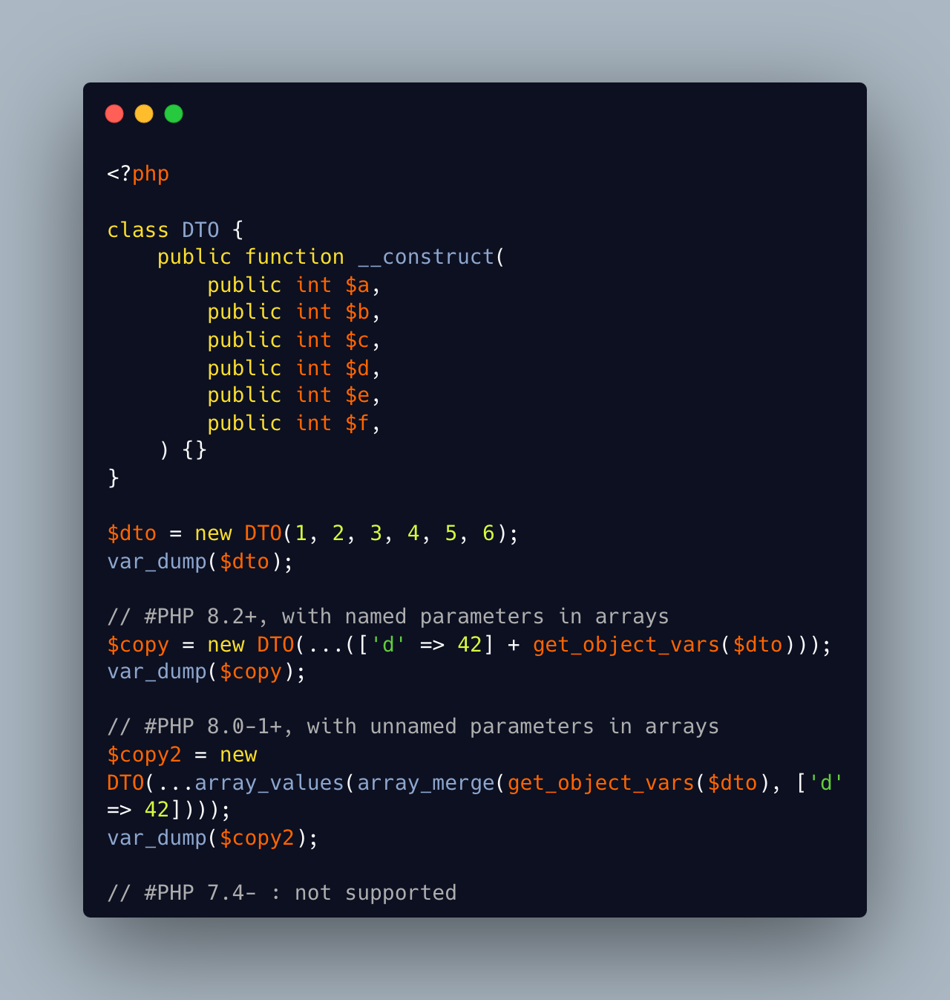

.. _quick-dto/vo-copy:

Quick DTO/VO copy
-----------------

By `Benoit Viguier <https://phpc.social/@b_viguier>`_

A small PHP trick, combining named parameters, spread and union arrays operators to « easily » create a modified copy of a DTO: https://3v4l.org/ZWX5G#v8.2.10

 It’s fun if you have a lot of parameters, but using a string containing the parameter’s name isn’t really satisfactory 😕

It is possible to extend this syntax to PHP 8.0+ with a clever array_values() / array_merge(): https://3v4l.org/igrsW

``$copy = new DTO(...(array_values(array_merge(get_object_vars($dto), ['d' => 43]))));``

Now, this extended syntax is an easy prey to property definition order, constructor argument order, and temporary property deletion, unlike your original approach.

* `Function arguments <https://www.php.net/manual/en/functions.arguments.php>`_

