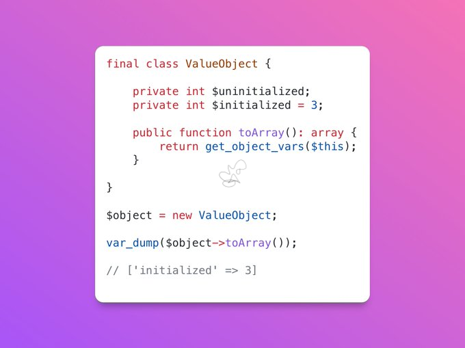

.. _quick-serialize:

Quick Serialize
---------------

.. meta::
	:description:
		Quick Serialize: Did you know that ``get_object_vars()`` only returns the initialized parameters from your objects.
	:twitter:card: summary_large_image
	:twitter:site: @exakat
	:twitter:title: Quick Serialize
	:twitter:description: Quick Serialize: Did you know that ``get_object_vars()`` only returns the initialized parameters from your objects
	:twitter:creator: @exakat
	:twitter:image:src: https://php-tips.readthedocs.io/en/latest/_images/quick_serialize.png
	:og:image: https://php-tips.readthedocs.io/en/latest/_images/quick_serialize.png
	:og:title: Quick Serialize
	:og:type: article
	:og:description: Did you know that ``get_object_vars()`` only returns the initialized parameters from your objects
	:og:url: https://php-tips.readthedocs.io/en/latest/tips/quick_serialize.html
	:og:locale: en

.. raw:: html

	

By `Doeke Norg <https://twitter.com/doekenorg>`_

Did you know that ``get_object_vars()`` only returns the initialized parameters from your objects? This can be very useful when (un)serializing objects.

PS : accessing uninitialized properties leads to a Fatal error. This trick avoids it.

See Also
________

* `Original <https://twitter.com/doekenorg/status/1706624773646594134>`_
* `get_object_vars() <https://www.php.net/get_object_vars>`_
* `initialized properties <https://3v4l.org/Dr6YT>`_ [Try me]

