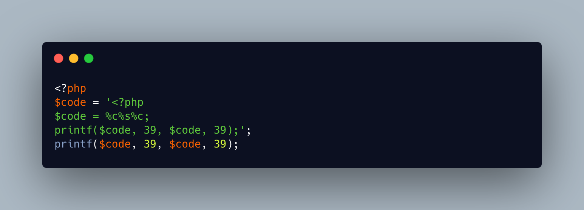

.. _php-quine:

PHP Quine
---------

.. meta::
	:description:
		PHP Quine: A quine is a piece of code that produces itself.
	:twitter:card: summary_large_image
	:twitter:site: @exakat
	:twitter:title: PHP Quine
	:twitter:description: PHP Quine: A quine is a piece of code that produces itself
	:twitter:creator: @exakat
	:twitter:image:src: https://php-tips.readthedocs.io/en/latest/_images/quine.png
	:og:image: https://php-tips.readthedocs.io/en/latest/_images/quine.png
	:og:title: PHP Quine
	:og:type: article
	:og:description: A quine is a piece of code that produces itself
	:og:url: https://php-tips.readthedocs.io/en/latest/tips/quine.html
	:og:locale: en

.. raw:: html

	

A quine is a piece of code that produces itself. It takes not input, and outputs a text that is its own code. The code is run to produce itself.

One may consider a file without PHP tags as a Quine: PHP executes such code by outputing the raw text. It is considered valid, yet too easy to be a quine.

See Also
________

* `Quine (Computing) <https://en.wikipedia.org/wiki/Quine_(computing)>`_
* `Quine Programs <https://cs.lmu.edu/~ray/notes/quineprograms/>`_
* `Quine in PHP <https://3v4l.org/X9TuF>`_ [Try me]

