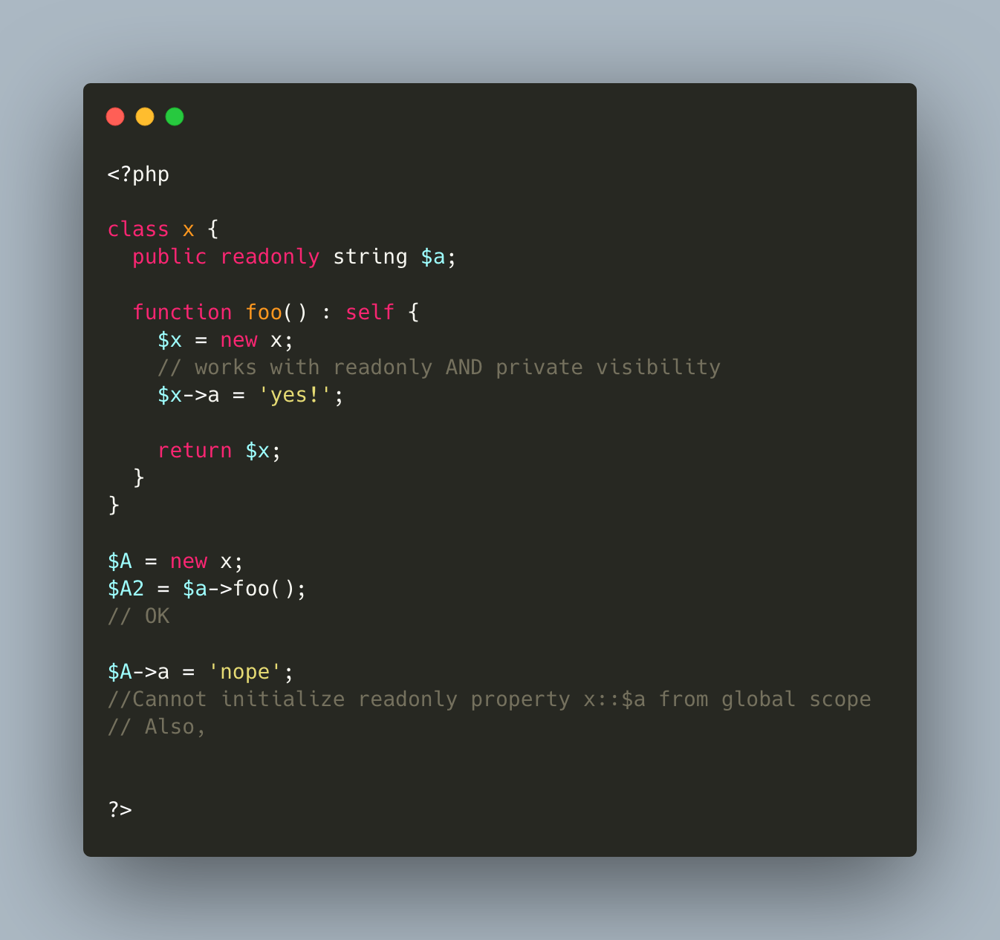

.. _set-readonly-properties-outside-the-class:

Set readonly Properties Outside The Class
-----------------------------------------

PHP 8.1 readonly properties cannot be set from global space, but they can be forced from the host class, just like accessing private properties. 

It doesn't work outside the host class : not in global space, not in a derived class.

Besides that, readonly act as usual : it is only possible to assign the property once.

* `Readonly properties <https://www.php.net/manual/en/language.oop5.properties.php#language.oop5.properties.readonly-properties>`_
* `Visibility <https://www.php.net/manual/en/language.oop5.visibility.php>`_
* `Class Invasation <https://php-dictionary.readthedocs.io/en/latest/dictionary.html#class-invasion>`_

