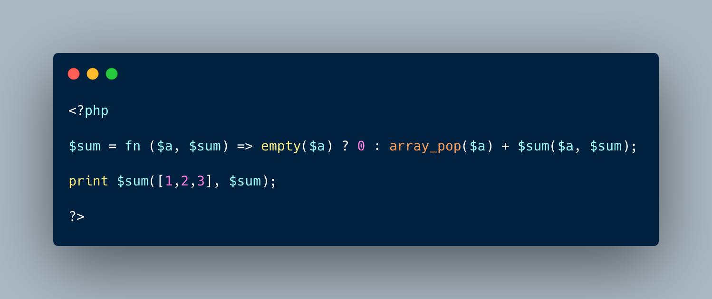

.. _recursive-arrow-function:

Recursive Arrow Function
------------------------

.. meta::
	:description:
		Recursive Arrow Function: To make an arrow function recursive, it must include itself in the list of arguments.
	:twitter:card: summary_large_image
	:twitter:site: @exakat
	:twitter:title: Recursive Arrow Function
	:twitter:description: Recursive Arrow Function: To make an arrow function recursive, it must include itself in the list of arguments
	:twitter:creator: @exakat
	:twitter:image:src: https://php-tips.readthedocs.io/en/latest/_images/recursive_arrow_function.png
	:og:image: https://php-tips.readthedocs.io/en/latest/_images/recursive_arrow_function.png
	:og:title: Recursive Arrow Function
	:og:type: article
	:og:description: To make an arrow function recursive, it must include itself in the list of arguments
	:og:url: https://php-tips.readthedocs.io/en/latest/tips/recursive_arrow_function.html
	:og:locale: en

.. raw:: html

	

To make an arrow function recursive, it must include itself in the list of arguments. That way, it can call itself.

The intriguing point here is that the arrow function is defined based on the current variables, and the function holding variable is only defined after the arrow function.

* `Arrow Functions (PHP manual) <https://www.php.net/manual/en/functions.arrow.php>`_
* `recursive arrow function <https://3v4l.org/BYubA>`_

