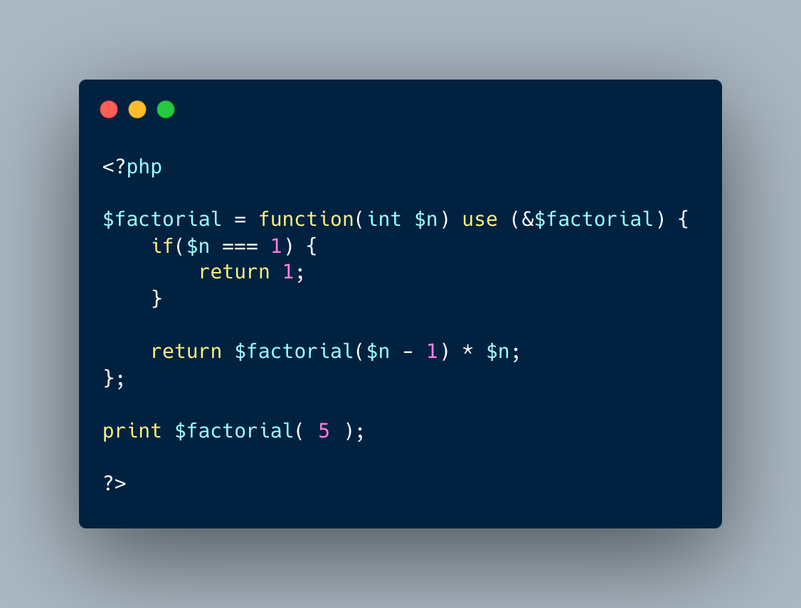

.. _recursive-closure:

Recursive Closure
-----------------

.. meta::
	:description:
		Recursive Closure: To make a recursive closure, the closure must be both stored in a variable and passed as a ``use`` parameter to the same factorial.
	:twitter:card: summary_large_image
	:twitter:site: @exakat
	:twitter:title: Recursive Closure
	:twitter:description: Recursive Closure: To make a recursive closure, the closure must be both stored in a variable and passed as a ``use`` parameter to the same factorial
	:twitter:creator: @exakat
	:twitter:image:src: https://php-tips.readthedocs.io/en/latest/_images/recursive_closure.png
	:og:image: https://php-tips.readthedocs.io/en/latest/_images/recursive_closure.png
	:og:title: Recursive Closure
	:og:type: article
	:og:description: To make a recursive closure, the closure must be both stored in a variable and passed as a ``use`` parameter to the same factorial
	:og:url: https://php-tips.readthedocs.io/en/latest/tips/recursive_closure.html
	:og:locale: en

.. raw:: html

	

To make a recursive closure, the closure must be both stored in a variable and passed as a ``use`` parameter to the same factorial.

It also works for arrow functions, although there is no the use, but the variable must be defined first, so it can be used in context later.

See Also
________

* `Closure (PHP manual) <https://www.php.net/manual/en/class.closure.php>`_
* `recursive closure <https://3v4l.org/3MHeR>`_

