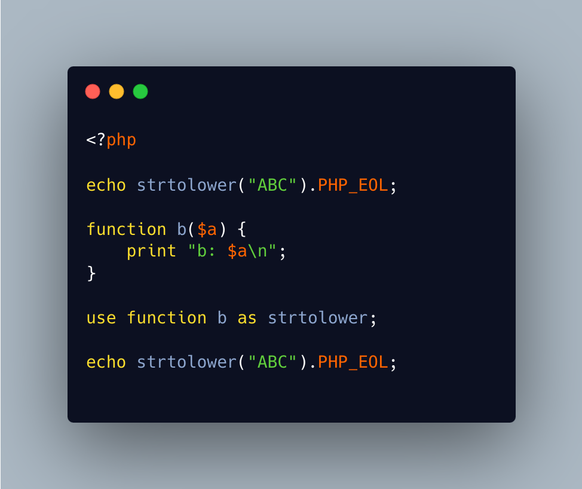

.. _redefine-native-functions:

Redefine Native Functions
-------------------------

.. meta::
	:description:
		Redefine Native Functions: It is possible to redefine PHP functions or constants, or even any defined of such, by using the ``use`` command.
	:twitter:card: summary_large_image
	:twitter:site: @exakat
	:twitter:title: Redefine Native Functions
	:twitter:description: Redefine Native Functions: It is possible to redefine PHP functions or constants, or even any defined of such, by using the ``use`` command
	:twitter:creator: @exakat
	:twitter:image:src: https://php-tips.readthedocs.io/en/latest/_images/redefine_native_functions.png
	:og:image: https://php-tips.readthedocs.io/en/latest/_images/redefine_native_functions.png
	:og:title: Redefine Native Functions
	:og:type: article
	:og:description: It is possible to redefine PHP functions or constants, or even any defined of such, by using the ``use`` command
	:og:url: https://php-tips.readthedocs.io/en/latest/tips/redefine_native_functions.html
	:og:locale: en

.. raw:: html

	

It is possible to redefine PHP functions or constants, or even any defined of such, by using the ``use`` command.

This feature is interesting for testing purposes: it allows the replacement of a defined function with an alternative.

It is not possible to do this twice in the same file, nor to redefine classes.

See Also
________

* `Redefining native PHP functions <https://3v4l.org/BM9C8>`_ [Try me]

PHP Features
____________

* `fallback-function <https://php-dictionary.readthedocs.io/en/latest/dictionary/fallback-function.ini.html>`_

* `use <https://php-dictionary.readthedocs.io/en/latest/dictionary/use.ini.html>`_

* `native <https://php-dictionary.readthedocs.io/en/latest/dictionary/native.ini.html>`_

