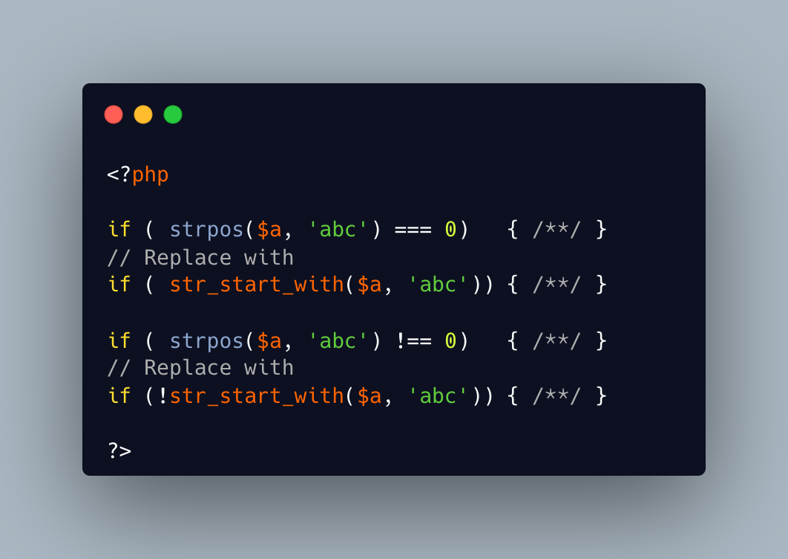

.. _refactoring-strpos():

Refactoring strpos()
--------------------

.. meta::
	:description:
		Refactoring strpos(): It is straightforward to convert an expression ``strpos() === 0``` to using the ``str_starts_with()`` function.
	:twitter:card: summary_large_image
	:twitter:site: @exakat
	:twitter:title: Refactoring strpos()
	:twitter:description: Refactoring strpos(): It is straightforward to convert an expression ``strpos() === 0``` to using the ``str_starts_with()`` function
	:twitter:creator: @exakat
	:twitter:image:src: https://php-tips.readthedocs.io/en/latest/_images/refactor_str_pos.png
	:og:image: https://php-tips.readthedocs.io/en/latest/_images/refactor_str_pos.png
	:og:title: Refactoring strpos()
	:og:type: article
	:og:description: It is straightforward to convert an expression ``strpos() === 0``` to using the ``str_starts_with()`` function
	:og:url: https://php-tips.readthedocs.io/en/latest/tips/refactor_str_pos.html
	:og:locale: en

.. raw:: html

	<script type="application/ld+json">{"@context":"https:\/\/schema.org","@graph":[{"@type":"WebPage","@id":"https:\/\/php-tips.readthedocs.io\/en\/latest\/tips\/refactor_str_pos.html","url":"https:\/\/php-tips.readthedocs.io\/en\/latest\/tips\/refactor_str_pos.html","name":"Refactoring strpos()","isPartOf":{"@id":"https:\/\/www.exakat.io\/"},"datePublished":"Tue, 27 May 2025 05:01:03 +0000","dateModified":"Tue, 27 May 2025 05:01:03 +0000","description":"It is straightforward to convert an expression ``strpos() === 0``` to using the ``str_starts_with()`` function","inLanguage":"en-US","potentialAction":[{"@type":"ReadAction","target":["https:\/\/php-tips.readthedocs.io\/en\/latest\/tips\/refactor_str_pos.html"]}]},{"@type":"WebSite","@id":"https:\/\/www.exakat.io\/","url":"https:\/\/www.exakat.io\/","name":"Exakat","description":"Smart PHP static analysis","inLanguage":"en-US"}]}</script>

It is straightforward to convert an expression ``strpos() === 0``` to using the ``str_starts_with()`` function. On the other hand, it is not the same to replace those functions when the comparison is a difference, not an equality.



See Also
________

* `strpos() <https://www.php.net/manual/strpos>`_
* `str_start_with() <https://www.php.net/manual/str_starts_with>`_
* `to be or not to be at the beginning of a string <https://3v4l.org/bO6YB>`_ [Try me]


PHP Error Messages
__________________


