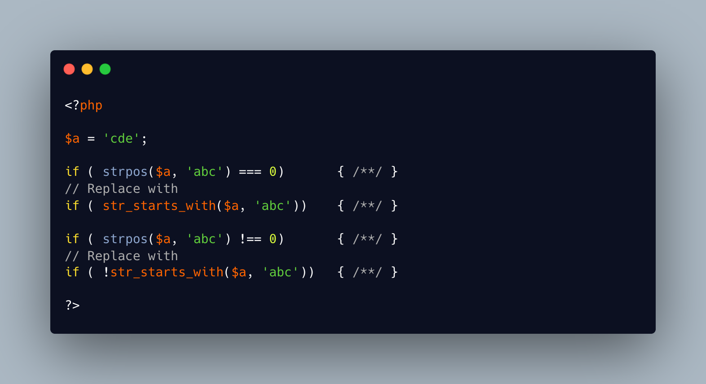

.. _refactoring-strpos():

Refactoring strpos()
--------------------

.. meta::
	:description:
		Refactoring strpos(): Converting an expression like ``strpos() === 0`` to use ``str_starts_with()`` is simple and direct.
	:twitter:card: summary_large_image
	:twitter:site: @exakat
	:twitter:title: Refactoring strpos()
	:twitter:description: Refactoring strpos(): Converting an expression like ``strpos() === 0`` to use ``str_starts_with()`` is simple and direct
	:twitter:creator: @exakat
	:twitter:image:src: https://php-tips.readthedocs.io/en/latest/_images/refactor_str_pos.png
	:og:image: https://php-tips.readthedocs.io/en/latest/_images/refactor_str_pos.png
	:og:title: Refactoring strpos()
	:og:type: article
	:og:description: Converting an expression like ``strpos() === 0`` to use ``str_starts_with()`` is simple and direct
	:og:url: https://php-tips.readthedocs.io/en/latest/tips/refactor_str_pos.html
	:og:locale: en

.. raw:: html

	

Converting an expression like ``strpos() === 0`` to use ``str_starts_with()`` is simple and direct. However, caution is needed when the comparison involves a difference rather than equality. In such cases, replacing the functions isn’t a straightforward one-to-one substitution, as the logic and intent behind the original expression may change, leading to unexpected behavior if not handled carefully.

See Also
________

* `strpos() <https://www.php.net/manual/strpos>`_
* `str_start_with() <https://www.php.net/manual/str_starts_with>`_
* `to be or not to be at the beginning of a string <https://3v4l.org/bO6YB>`_ [Try me]

