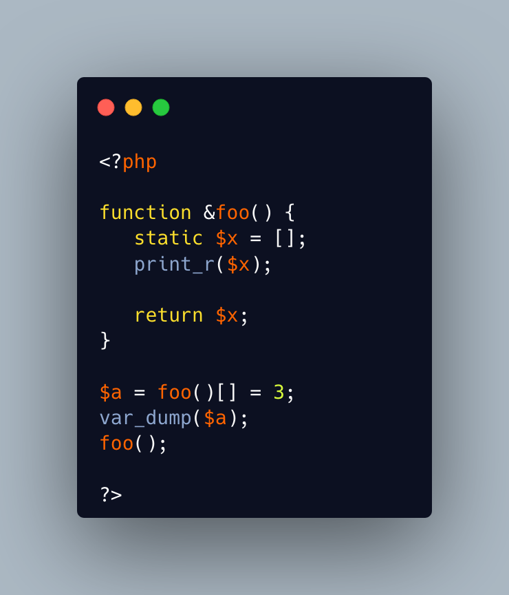

.. _edit-a-static-variable-outside-its-function:

Edit a static variable outside its function
-------------------------------------------

Static variables are persistent between calls to the same method. They are local, unless they are returned with a reference. Then, they can be accessed in the main code, and read or even written.

This is the case here, without even storing the value: it is actually updated on the fly with the array notation on the function call. 

* `Static variables (PHP manual) <https://www.php.net/manual/en/language.variables.scope.php#language.variables.scope.static>`_

