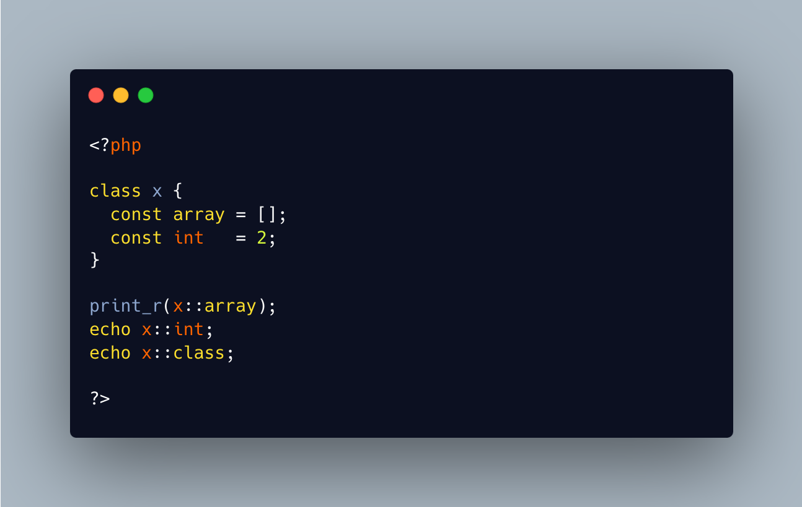

.. _relaxed-syntax-with-const:

Relaxed Syntax With Const
-------------------------

.. meta::
	:description:
		Relaxed Syntax With Const: Relaxed syntax is the possibility to use PHP keywords as method or class constant names.
	:twitter:card: summary_large_image
	:twitter:site: @exakat
	:twitter:title: Relaxed Syntax With Const
	:twitter:description: Relaxed Syntax With Const: Relaxed syntax is the possibility to use PHP keywords as method or class constant names
	:twitter:creator: @exakat
	:twitter:image:src: https://php-tips.readthedocs.io/en/latest/_images/relaxed_syntax_with_const.png
	:og:image: https://php-tips.readthedocs.io/en/latest/_images/relaxed_syntax_with_const.png
	:og:title: Relaxed Syntax With Const
	:og:type: article
	:og:description: Relaxed syntax is the possibility to use PHP keywords as method or class constant names
	:og:url: https://php-tips.readthedocs.io/en/latest/tips/relaxed_syntax_with_const.html
	:og:locale: en

.. raw:: html

	

Relaxed syntax is the possibility to use PHP keywords as method or class constant names. This leads to funny expressions, that look like something else.

The only forbidden keyword is ``class``, as it is used to report the name of the current class.

See Also
________

* `Void (PHP manual) <https://www.php.net/manual/en/language.types.void.php>`_

