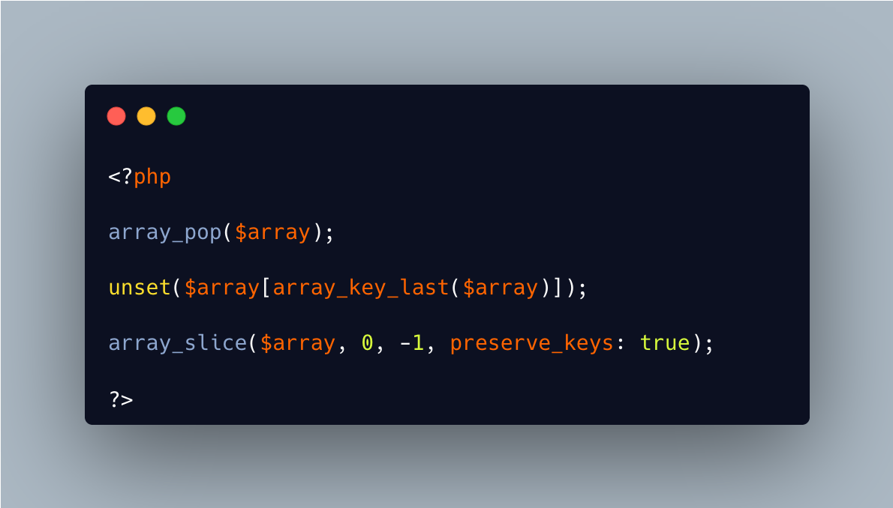

.. _remove-last-item-in-an-array:

Remove Last Item In An Array
----------------------------

.. meta::
	:description:
		Remove Last Item In An Array: Three ways to remove the last item in an array.
	:twitter:card: summary_large_image
	:twitter:site: @exakat
	:twitter:title: Remove Last Item In An Array
	:twitter:description: Remove Last Item In An Array: Three ways to remove the last item in an array
	:twitter:creator: @exakat
	:twitter:image:src: https://php-tips.readthedocs.io/en/latest/_images/remove_last_item.png
	:og:image: https://php-tips.readthedocs.io/en/latest/_images/remove_last_item.png
	:og:title: Remove Last Item In An Array
	:og:type: article
	:og:description: Three ways to remove the last item in an array
	:og:url: https://php-tips.readthedocs.io/en/latest/tips/remove_last_item.html
	:og:locale: en

.. raw:: html

	

Three ways to remove the last item in an array.

array_pop() is the most adapted function, as it does actually that.

unset() is dedicated to removing elements, though it requires the calculation of the last key before. It is still the fastest of all three.

array_slice() works with the negative offset, just like a string. It is not too much slower, until one realize its result needs to be reassigned.

All in all, they need a good million iterations to see actual performances differences. It is a micro-optimisation.

See Also
________

* `array_slice() (PHP manual) <https://www.php.net/manual/en/function.array-slice.php>`_
* `unset() (PHP manual) <https://www.php.net/manual/en/function.unset.php>`_
* `array_pop() (PHP manual) <https://www.php.net/manual/en/function.array-pop.php>`_
* `comparisons <https://3v4l.org/bEaBT>`_ [Try me]

