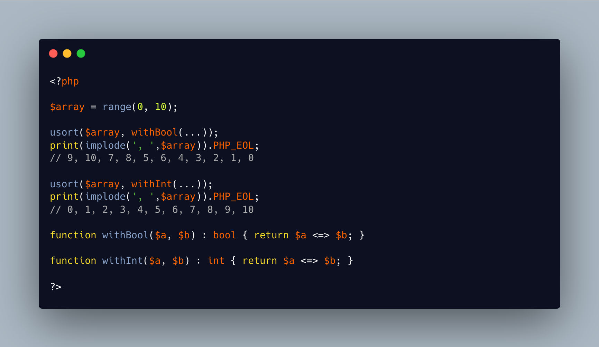

.. _return-int-not-bool:

Return Int Not Bool
-------------------

.. meta::
	:description:
		Return Int Not Bool: There is a cute deprecation warning, when using a closure to sort an array: ``Deprecated: usort(): Returning bool from comparison function is deprecated, return an integer less than, equal to, or greater than zero``.
	:twitter:card: summary_large_image
	:twitter:site: @exakat
	:twitter:title: Return Int Not Bool
	:twitter:description: Return Int Not Bool: There is a cute deprecation warning, when using a closure to sort an array: ``Deprecated: usort(): Returning bool from comparison function is deprecated, return an integer less than, equal to, or greater than zero``
	:twitter:creator: @exakat
	:twitter:image:src: https://php-tips.readthedocs.io/en/latest/_images/return_int_not_bool.png
	:og:image: https://php-tips.readthedocs.io/en/latest/_images/return_int_not_bool.png
	:og:title: Return Int Not Bool
	:og:type: article
	:og:description: There is a cute deprecation warning, when using a closure to sort an array: ``Deprecated: usort(): Returning bool from comparison function is deprecated, return an integer less than, equal to, or greater than zero``
	:og:url: https://php-tips.readthedocs.io/en/latest/tips/return_int_not_bool.html
	:og:locale: en

.. raw:: html

	

There is a cute deprecation warning, when using a closure to sort an array: ``Deprecated: usort(): Returning bool from comparison function is deprecated, return an integer less than, equal to, or greater than zero``.

And if this deprecation is ignored, the boolean is cast automatically to an integer. As PHP turns 0 to false, and everything else, including 1 and -1 to true, this leads to surprising sorting effect.

Just trust the deprecation notice.

See Also
________

* `usort (PHP manual) <https://www.php.net/manual/en/function.usort.php>`_
* `Comparison Operator <https://www.php.net/manual/en/language.operators.comparison.php>`_

