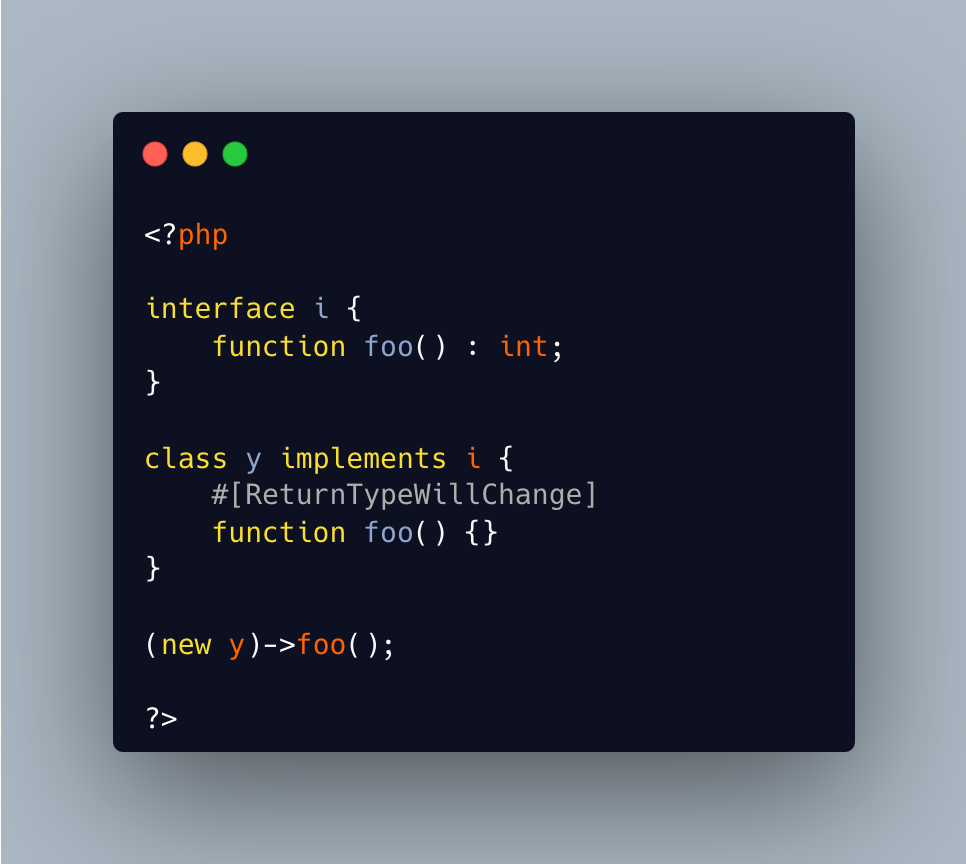

.. _returntypewillchange-is-for-all:

ReturnTypeWillChange Is For All
-------------------------------

.. meta::
	:description:
		ReturnTypeWillChange Is For All: ReturnTypeWillChange is an attribute that tells PHP that the return type of the related method is different from the defined by the PHP native methods.
	:twitter:card: summary_large_image
	:twitter:site: @exakat
	:twitter:title: ReturnTypeWillChange Is For All
	:twitter:description: ReturnTypeWillChange Is For All: ReturnTypeWillChange is an attribute that tells PHP that the return type of the related method is different from the defined by the PHP native methods
	:twitter:creator: @exakat
	:twitter:image:src: https://php-tips.readthedocs.io/en/latest/_images/returntypewillchange_for_all.png
	:og:image: https://php-tips.readthedocs.io/en/latest/_images/returntypewillchange_for_all.png
	:og:title: ReturnTypeWillChange Is For All
	:og:type: article
	:og:description: ReturnTypeWillChange is an attribute that tells PHP that the return type of the related method is different from the defined by the PHP native methods
	:og:url: https://php-tips.readthedocs.io/en/latest/tips/returntypewillchange_for_all.html
	:og:locale: en

ReturnTypeWillChange is an attribute that tells PHP that the return type of the related method is different from the defined by the PHP native methods. In fact, this attribute may also be used on custom interfaces, to skip the type checks.

* `ReturnTypeWillChange (PHP manual) <https://www.php.net/manual/en/class.returntypewillchange.php>`_

