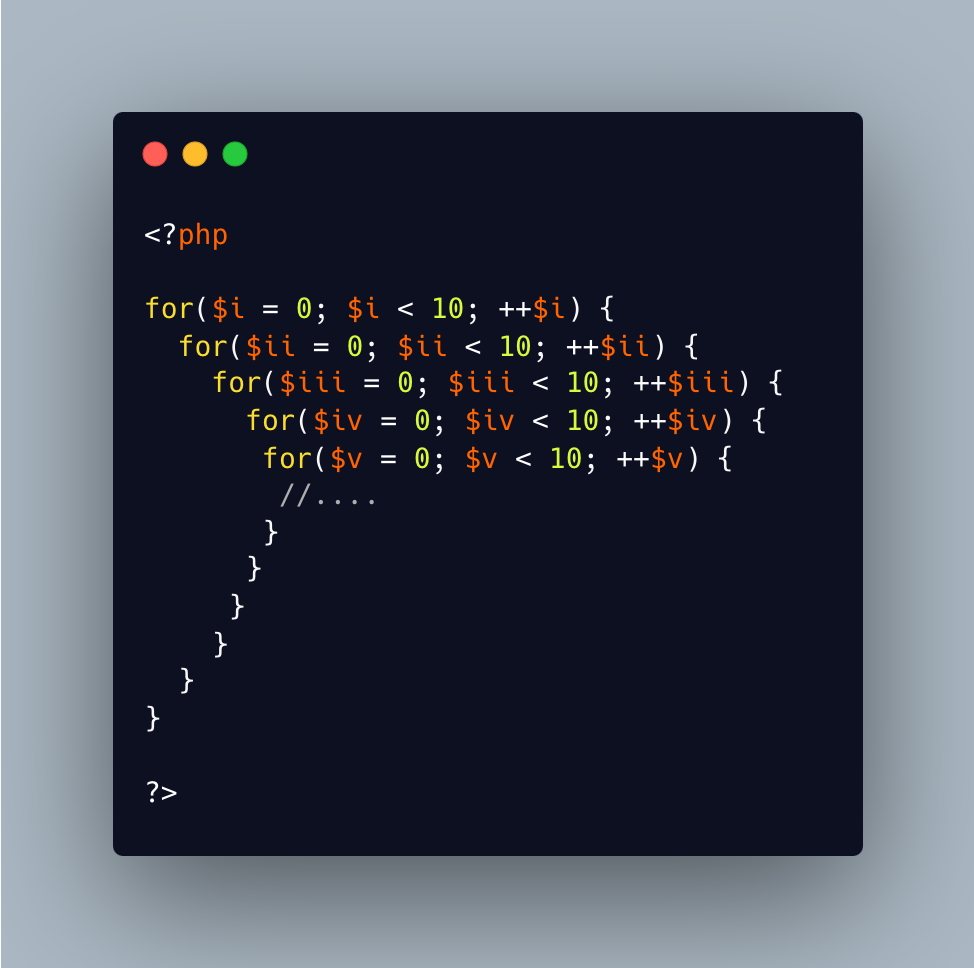

.. _roman-loops:

Roman Loops
-----------

.. meta::
	:description:
		Roman Loops: If the classic variable with a for() loop is ``$i``, then nested loop should use ``$ii``, then ``$iii``, ``$iv``, ``$v``.
	:twitter:card: summary_large_image
	:twitter:site: @exakat
	:twitter:title: Roman Loops
	:twitter:description: Roman Loops: If the classic variable with a for() loop is ``$i``, then nested loop should use ``$ii``, then ``$iii``, ``$iv``, ``$v``
	:twitter:creator: @exakat
	:twitter:image:src: https://php-tips.readthedocs.io/en/latest/_images/roman_loops.png
	:og:image: https://php-tips.readthedocs.io/en/latest/_images/roman_loops.png
	:og:title: Roman Loops
	:og:type: article
	:og:description: If the classic variable with a for() loop is ``$i``, then nested loop should use ``$ii``, then ``$iii``, ``$iv``, ``$v``
	:og:url: https://php-tips.readthedocs.io/en/latest/tips/roman_loops.html
	:og:locale: en

.. raw:: html

	

By `Stephen Rees-Carter <https://twitter.com/valorin>`_

If the classic variable with a for() loop is ``$i``, then nested loop should use ``$ii``, then ``$iii``, ``$iv``, ``$v``.

* `Original Tweet <https://twitter.com/valorin/status/1745688764465218033>`_
* `Original Source <https://twitter.com/trunarla/status/1745582255840649608>`_

