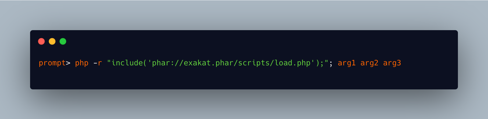

.. _run-any-script-in-a-phar:

Run Any Script In A Phar
------------------------

.. meta::
	:description:
		Run Any Script In A Phar: It is not possible to call directly a PHP script stored in a Phar archive: the only way to reach it, is using ``include 'phar://$path'``, where PHP understands the ``phar://`` protocol.
	:twitter:card: summary_large_image
	:twitter:site: @exakat
	:twitter:title: Run Any Script In A Phar
	:twitter:description: Run Any Script In A Phar: It is not possible to call directly a PHP script stored in a Phar archive: the only way to reach it, is using ``include 'phar://$path'``, where PHP understands the ``phar://`` protocol
	:twitter:creator: @exakat
	:twitter:image:src: https://php-tips.readthedocs.io/en/latest/_images/run_any_phar_file.png
	:og:image: https://php-tips.readthedocs.io/en/latest/_images/run_any_phar_file.png
	:og:title: Run Any Script In A Phar
	:og:type: article
	:og:description: It is not possible to call directly a PHP script stored in a Phar archive: the only way to reach it, is using ``include 'phar://$path'``, where PHP understands the ``phar://`` protocol
	:og:url: https://php-tips.readthedocs.io/en/latest/tips/run_any_phar_file.html
	:og:locale: en

.. raw:: html

	

It is not possible to call directly a PHP script stored in a Phar archive: the only way to reach it, is using ``include 'phar://$path'``, where PHP understands the ``phar://`` protocol.

And that makes it possible to call directly a PHP script from the shell: include it directly.

In terms of security, it is important to remember that a PHAR is an archive, and anything may be accessed or extracted.

See Also
________

* `Phar (PHP manual) <https://www.php.net/manual/en/book.phar.php>`_
* `include on phar <https://3v4l.org/s9jrt>`_ [Try me]

PHP Features
____________

* `phar <https://php-dictionary.readthedocs.io/en/latest/dictionary/phar.ini.html>`_

