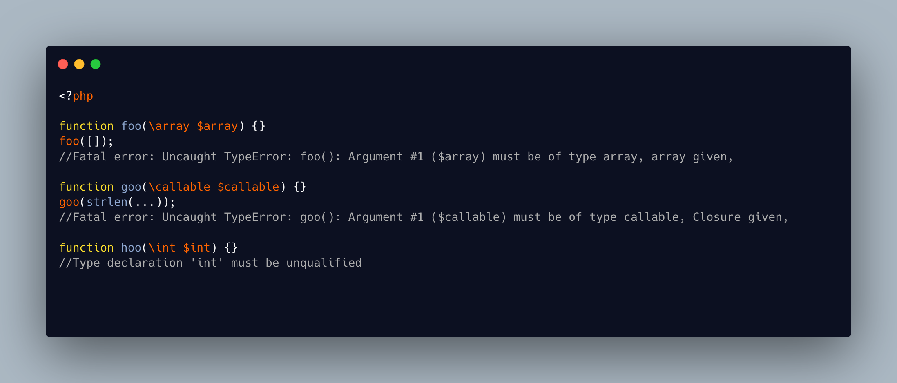

.. _scalar-types-are-unqualified:

Scalar Types Are Unqualified
----------------------------

.. meta::
	:description:
		Scalar Types Are Unqualified: Scalar types like ``int `` or  ``iterable`` should be used without a leading slash.
	:twitter:card: summary_large_image
	:twitter:site: @exakat
	:twitter:title: Scalar Types Are Unqualified
	:twitter:description: Scalar Types Are Unqualified: Scalar types like ``int `` or  ``iterable`` should be used without a leading slash
	:twitter:creator: @exakat
	:twitter:image:src: https://php-tips.readthedocs.io/en/latest/_images/scalar_types_are_unqualified.png
	:og:image: https://php-tips.readthedocs.io/en/latest/_images/scalar_types_are_unqualified.png
	:og:title: Scalar Types Are Unqualified
	:og:type: article
	:og:description: Scalar types like ``int `` or  ``iterable`` should be used without a leading slash
	:og:url: https://php-tips.readthedocs.io/en/latest/tips/scalar_types_are_unqualified.html
	:og:locale: en

.. raw:: html

	

Scalar types like ``int `` or  ``iterable`` should be used without a leading slash. However, there are exceptions. In PHP 8.3, types such as  ``callable `` and  ``array`` are still misinterpreted as class names, which can result in confusing or poorly worded error messages. This inconsistency remains a known issue in the language, affecting type declarations and error reporting for these specific cases, until PHP 8.5.

See Also
________

* `Type declaration (PHP manual) <https://www.php.net/manual/en/language.types.declarations.php>`_
* `strange error messages <https://3v4l.org/YRE3Q>`_ [Try me]

