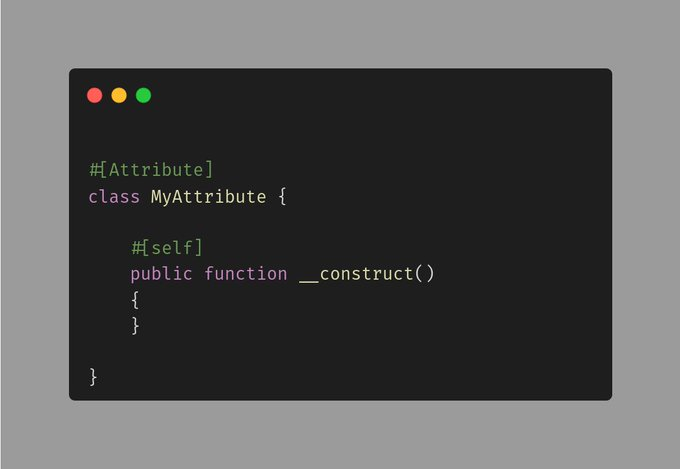

.. _self-as-attribute:

Self As Attribute
-----------------

.. meta::
	:description:
		Self As Attribute: Self, parent and static cannot be used as attributes.
	:twitter:card: summary_large_image
	:twitter:site: @exakat
	:twitter:title: Self As Attribute
	:twitter:description: Self As Attribute: Self, parent and static cannot be used as attributes
	:twitter:creator: @exakat
	:twitter:image:src: https://php-tips.readthedocs.io/en/latest/_images/self-as-attribute.png
	:og:image: https://php-tips.readthedocs.io/en/latest/_images/self-as-attribute.png
	:og:title: Self As Attribute
	:og:type: article
	:og:description: Self, parent and static cannot be used as attributes
	:og:url: https://php-tips.readthedocs.io/en/latest/tips/self-as-attribute.html
	:og:locale: en

By `Jan Nedbal <https://janedbal.cz/>`_

Self, parent and static cannot be used as attributes. They are not recognized, and PHP will search for a class called ``\self`` instead, in vain.

On the other hand, it is possible to use an attribute onto its own methods, simply by using its regular name.

It is possible to use these names as attributes, as long as they are not instanciated.

It is also possible to use aliases with the attributes: they will automatically resolve to the original class, not the aliased name.

* `Void (PHP manual) <https://www.php.net/manual/en/language.types.void.php>`_
* `Original tweet <https://twitter.com/janedbal/status/1830573580251288042>`_

