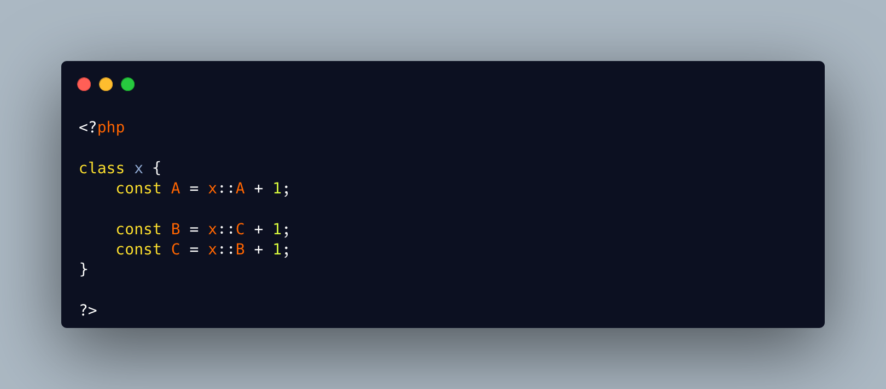

.. _no-self-referencing-constants:

No Self Referencing Constants
-----------------------------

.. meta::
	:description:
		No Self Referencing Constants: It is not possible to define a recursive PHP class constant, although it is possible to write it.

It is not possible to define a recursive PHP class constant, although it is possible to write it. A self referencing constant may be with itself, or it may use a complex right of class definitions before failing.

There is a dedicated PHP error message for this situation: 'Cannot declare self-referencing constant'.

One fun aspect is that the is not detected at compilation time, but at execution time, when the constant is actually used. The problem may lie dormant for a long time before revealing itself.

* `Cannot declare self-referencing constant <https://php-errors.readthedocs.io/en/latest/messages/cannot-declare-self-referencing-constant.html>`_

