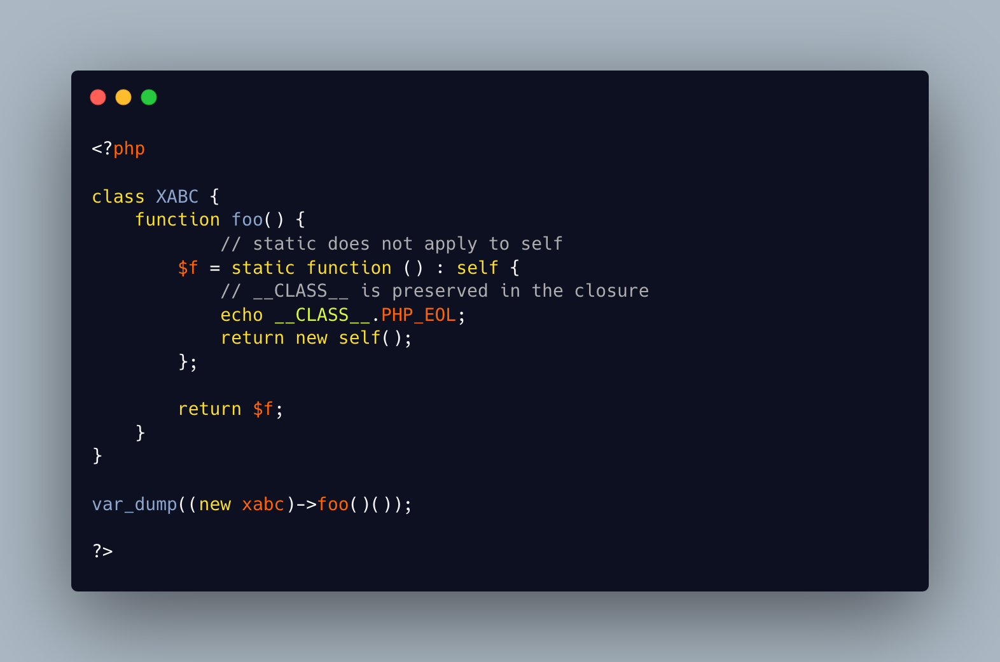

.. _self-is-a-valid-type-on-a-closure:

self Is A Valid Type On A Closure
---------------------------------

.. meta::
	:description:
		self Is A Valid Type On A Closure: ``self`` is a valid type inside a class (trait, interface, enum) to reference the current class.
	:twitter:card: summary_large_image
	:twitter:site: @exakat
	:twitter:title: self Is A Valid Type On A Closure
	:twitter:description: self Is A Valid Type On A Closure: ``self`` is a valid type inside a class (trait, interface, enum) to reference the current class
	:twitter:creator: @exakat
	:twitter:image:src: https://php-tips.readthedocs.io/en/latest/_images/selfOnAClosure.png
	:og:image: https://php-tips.readthedocs.io/en/latest/_images/selfOnAClosure.png
	:og:title: self Is A Valid Type On A Closure
	:og:type: article
	:og:description: ``self`` is a valid type inside a class (trait, interface, enum) to reference the current class
	:og:url: https://php-tips.readthedocs.io/en/latest/tips/selfOnAClosure.html
	:og:locale: en

.. raw:: html

	

``self`` is a valid type inside a class (trait, interface, enum) to reference the current class. ``self`` may also be used with a closure, since the closure use its location of definition. The class name may be exported that way, and instantiated outside the original class.

This applies to ``static`` and ``parent`` too. Try it wit ``static`` for extra fun.

This tips also applies when the closure is made static, although it might be surprising.

This tip applies to arrow functions.

This tip does not applies to functions created in a class (ugh...).

See Also
________

* `Scope Resolution Operator (::) (PHP manual) <https://www.php.net/manual/en/language.oop5.paamayim-nekudotayim.php>`_
* `self on a closure <https://3v4l.org/PAjY6>`_ [Try me]

PHP Features
____________

* `self <https://php-dictionary.readthedocs.io/en/latest/dictionary/self.ini.html>`_

* `closure <https://php-dictionary.readthedocs.io/en/latest/dictionary/closure.ini.html>`_

* `static <https://php-dictionary.readthedocs.io/en/latest/dictionary/static.ini.html>`_

