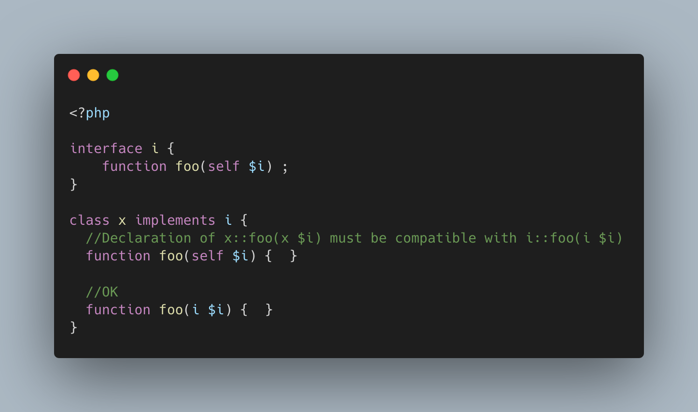

.. _self-in-an-interface:

Self In An Interface
--------------------

.. meta::
	:description:
		Self In An Interface: The keyword self in an interface represente that interface: it does not represent the host class.
	:twitter:card: summary_large_image
	:twitter:site: @exakat
	:twitter:title: Self In An Interface
	:twitter:description: Self In An Interface: The keyword self in an interface represente that interface: it does not represent the host class
	:twitter:creator: @exakat
	:twitter:image:src: https://php-tips.readthedocs.io/en/latest/_images/self_in_interface.png
	:og:image: https://php-tips.readthedocs.io/en/latest/_images/self_in_interface.png
	:og:title: Self In An Interface
	:og:type: article
	:og:description: The keyword self in an interface represente that interface: it does not represent the host class
	:og:url: https://php-tips.readthedocs.io/en/latest/tips/self_in_interface.html
	:og:locale: en

.. raw:: html

	

The keyword self in an interface represente that interface: it does not represent the host class. Hence, using self as return type means that the method must return an object that implements the type ``i``, not of the host class.

See Also
________

* `Scope Resolution Operator (::) <https://www.php.net/manual/en/language.oop5.paamayim-nekudotayim.php>`_
* `interface, not class <https://3v4l.org/DANG4>`_ [Try me]

