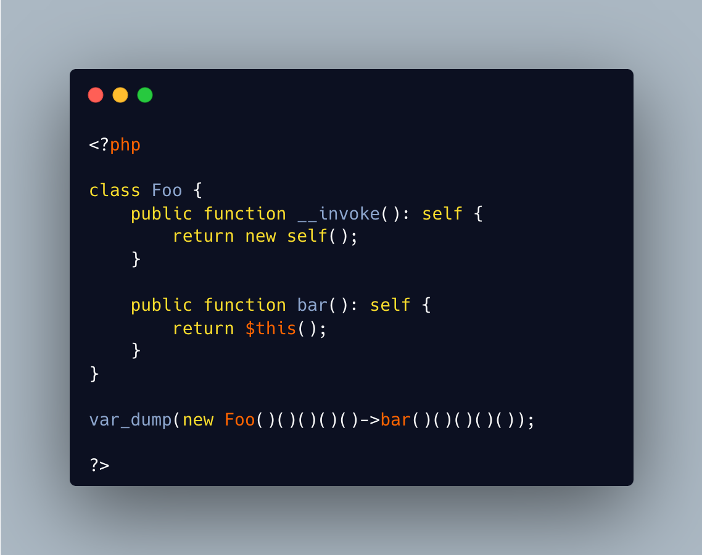

.. _lots-of-silly-arguments:

Lots Of Silly Arguments
-----------------------

.. meta::
	:description:
		Lots Of Silly Arguments: PHP 8.
	:twitter:card: summary_large_image
	:twitter:site: @exakat
	:twitter:title: Lots Of Silly Arguments
	:twitter:description: Lots Of Silly Arguments: PHP 8
	:twitter:creator: @exakat
	:twitter:image:src: https://php-tips.readthedocs.io/en/latest/_images/self_invoking.png.png
	:og:image: https://php-tips.readthedocs.io/en/latest/_images/self_invoking.png
	:og:title: Lots Of Silly Arguments
	:og:type: article
	:og:description: PHP 8
	:og:url: https://php-tips.readthedocs.io/en/latest/tips/self_invoking.html
	:og:locale: en

By `Greg Korba <https://twitter.com/_Codito_>`_

PHP 8.4 drops the requirement of parenthesis around the new operator: it is possible to directly call a method on it.

Then, it is also possible to use an object as a method, by creating the __invoke() magic method. In this case, it returns a new instance of the class.

Finally, it is possible to call a function whose name is the result of a previous call.

The final result is quite impressive.

* `__invoke() (PHP manual) <https://www.php.net/manual/en/language.oop5.magic.php#object.invoke>`_

