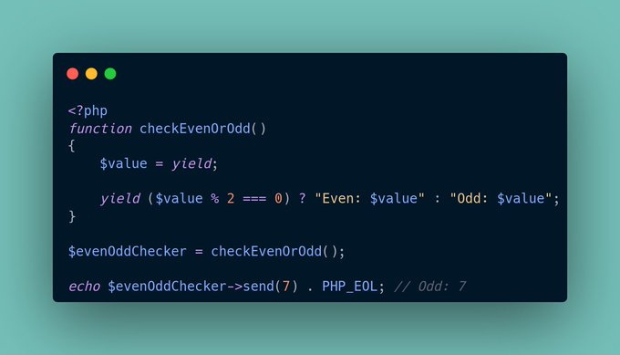

.. _send-an-argument-to-generator:

Send An Argument To Generator
-----------------------------

.. meta::
	:description:
		Send An Argument To Generator: When calling the method send() on a PHP generator, the result of the first yield keyword is the argument value.
	:twitter:card: summary_large_image
	:twitter:site: @exakat
	:twitter:title: Send An Argument To Generator
	:twitter:description: Send An Argument To Generator: When calling the method send() on a PHP generator, the result of the first yield keyword is the argument value
	:twitter:creator: @exakat
	:twitter:image:src: https://php-tips.readthedocs.io/en/latest/_images/send_to_generator.png
	:og:image: https://php-tips.readthedocs.io/en/latest/_images/send_to_generator.png
	:og:title: Send An Argument To Generator
	:og:type: article
	:og:description: When calling the method send() on a PHP generator, the result of the first yield keyword is the argument value
	:og:url: https://php-tips.readthedocs.io/en/latest/tips/send_to_generator.html
	:og:locale: en

.. raw:: html

	

By `Rahul Chavan <https://twitter.com/rcsofttech85>`_

When calling the method send() on a PHP generator, the result of the first yield keyword is the argument value. Then, it can be used to yield a specific result.

Upon usage on a foreach(), that generator will generate 2 values.

Generator::send() only accepts one argument.

See Also
________

* `example on 3v4l.org <https://3v4l.org/ouPhi>`_ [Try me]
* `Generator::send() <https://www.php.net/manual/en/generator.send.php>`_

