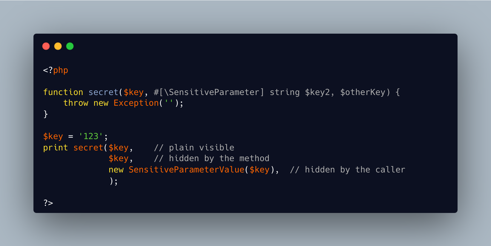

.. _hide-sensitive-parameter:

Hide Sensitive Parameter
------------------------

.. meta::
	:description:
		Hide Sensitive Parameter: PHP 8.
	:twitter:card: summary_large_image
	:twitter:site: @exakat
	:twitter:title: Hide Sensitive Parameter
	:twitter:description: Hide Sensitive Parameter: PHP 8
	:twitter:creator: @exakat
	:twitter:image:src: https://php-tips.readthedocs.io/en/latest/_images/sensitiveParameter.png
	:og:image: https://php-tips.readthedocs.io/en/latest/_images/sensitiveParameter.png
	:og:title: Hide Sensitive Parameter
	:og:type: article
	:og:description: PHP 8
	:og:url: https://php-tips.readthedocs.io/en/latest/tips/sensitiveParameter.html
	:og:locale: en

.. raw:: html

	

PHP 8.2 introduces the ``#[SensitiveParameter]`` attribute to hide sensitive values from debug messages when used on function parameters. Additionally, the ``SensitiveParameterValue`` class allows you to mark data as sensitive at the caller level, ensuring it won’t appear in stack traces. To retrieve the original value when needed, simply call the ``$object->getValue()`` method.

See Also
________

* `SensitiveParameter (PHP manual) <https://www.php.net/manual/en/class.sensitiveparameter.php>`_
* `SensitiveParameterValue (PHP manual) <https://www.php.net/manual/en/class.sensitiveparametervalue.php>`_
* `Hide sensitive parameters <https://3v4l.org/dEPeZ>`_ [Try me]

