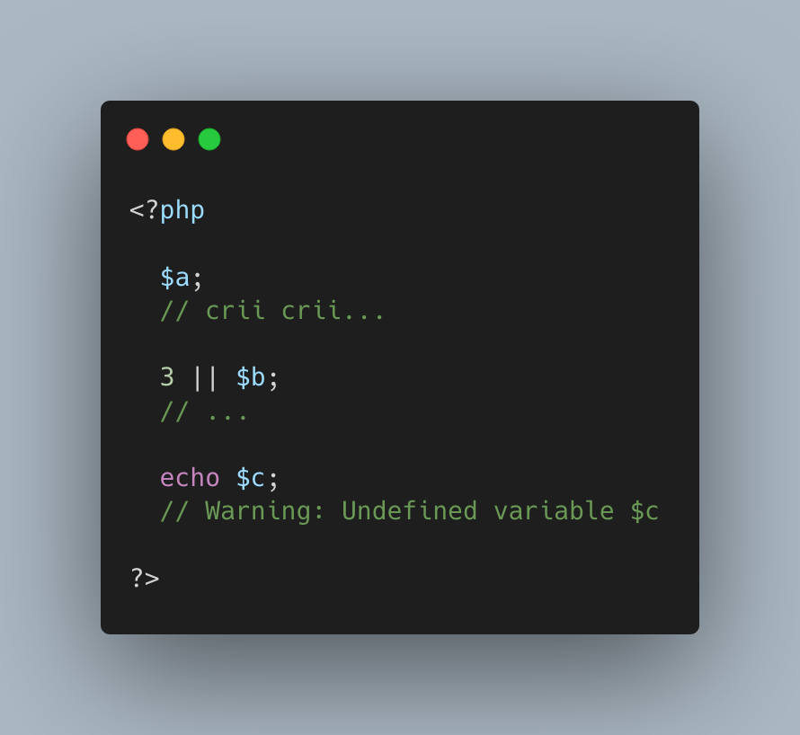

.. _silent-optimisation-of-variables:

Silent Optimisation Of Variables
--------------------------------

.. meta::
	:description:
		Silent Optimisation Of Variables: See PHP optimisation in action: undefined variables are only reported when they are used (sic).
	:twitter:card: summary_large_image
	:twitter:site: @exakat
	:twitter:title: Silent Optimisation Of Variables
	:twitter:description: Silent Optimisation Of Variables: See PHP optimisation in action: undefined variables are only reported when they are used (sic)
	:twitter:creator: @exakat
	:twitter:image:src: https://php-tips.readthedocs.io/en/latest/_images/silent_optimisation.png
	:og:image: https://php-tips.readthedocs.io/en/latest/_images/silent_optimisation.png
	:og:title: Silent Optimisation Of Variables
	:og:type: article
	:og:description: See PHP optimisation in action: undefined variables are only reported when they are used (sic)
	:og:url: https://php-tips.readthedocs.io/en/latest/tips/silent_optimisation.html
	:og:locale: en

.. raw:: html

	

See PHP optimisation in action: undefined variables are only reported when they are used (sic).

The first one is omitted : there are no operation with it.

The second one is skipped: no need to execute 2nd term when the first one is already true.

The third one is reporting a warning, as expected.

See Also
________

* `Silent PHP Optimisation <https://3v4l.org/6gQeh>`_ [Try me]

PHP Error Messages
__________________

* `Undefined variable %s <https://php-errors.readthedocs.io/en/latest/messages/undefined-variable-%24%25s.html>`_

PHP Features
____________

* `silent <https://php-dictionary.readthedocs.io/en/latest/dictionary/silent.ini.html>`_

* `variable <https://php-dictionary.readthedocs.io/en/latest/dictionary/variable.ini.html>`_

