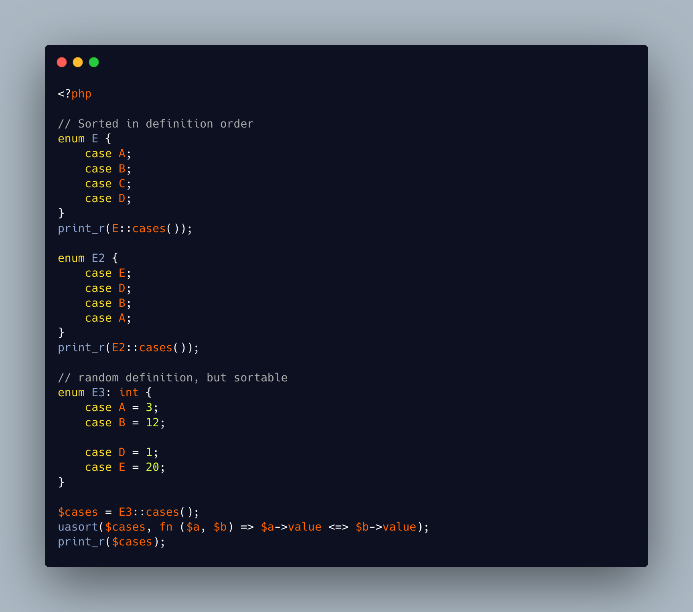

.. _sorting-enum:

Sorting Enum
------------

.. meta::
	:description:
		Sorting Enum: Enum cases are sorted, by default, with their definition order.
	:twitter:card: summary_large_image
	:twitter:site: @exakat
	:twitter:title: Sorting Enum
	:twitter:description: Sorting Enum: Enum cases are sorted, by default, with their definition order
	:twitter:creator: @exakat
	:twitter:image:src: https://php-tips.readthedocs.io/en/latest/_images/sorting_enum.png
	:og:image: https://php-tips.readthedocs.io/en/latest/_images/sorting_enum.png
	:og:title: Sorting Enum
	:og:type: article
	:og:description: Enum cases are sorted, by default, with their definition order
	:og:url: https://php-tips.readthedocs.io/en/latest/tips/sorting_enum.html
	:og:locale: en

.. raw:: html

	

Enum cases are sorted, by default, with their definition order. The name of the case does not matter, just the position of definition within the enumeration.

When the order of definition cannot be changed, as per coding convention, the cases may be backed, and then, sorted at the last moment. Just know that the cases must be in a variable first.

See Also
________

* `When your enum case order actually matters <https://masteringlaravel.io/daily/2026-04-09-when-your-enum-case-order-actually-matters>`_
* `Sorting Enums <https://3v4l.org/R1pFL>`_ [Try me]

PHP Error Messages
__________________

* `Only variables should be passed by reference <https://php-errors.readthedocs.io/en/latest/messages/only-variables-should-be-passed-by-reference.html>`_

PHP Features
____________

* `enum <https://php-dictionary.readthedocs.io/en/latest/dictionary/enum.ini.html>`_

* `case <https://php-dictionary.readthedocs.io/en/latest/dictionary/case.ini.html>`_

* `sort <https://php-dictionary.readthedocs.io/en/latest/dictionary/sort.ini.html>`_

