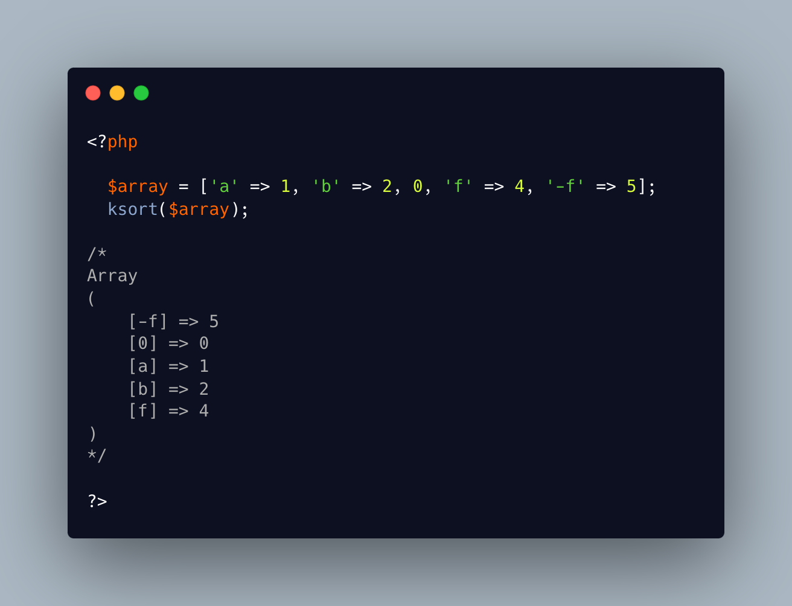

.. _sorting-with-minus:

Sorting With Minus
------------------

.. meta::
	:description:
		Sorting With Minus: Did you know that sorting f, 0 and -f actually ends up with -f first, then 0, then f.

Did you know that sorting f, 0 and -f actually ends up with -f first, then 0, then f. And this works with any string, including strings with duplicate initial minus sign.

This is the SORT_REGULAR, with which PHP compares 'normally' different pieces of data. Any string whose first character has an ASCII code lower than 0 will be sorted first (in PHP 8.2+) : this means characters up to /. Then any starting character beyond 9, aka colon and beyond, will be sorted after the 0 (or any digit).

That normal sort is used in ksort() and krsort() since PHP 8.2. This means that these functions may behave differently, when the keys string start with a '-' since.

This sort will sort string starting with '-' first: given the ASCII table, it also will sort strings starting with '+' before the '-'. Use with feature with caution.

* `PHP 8.2 incompatibilities <https://www.php.net/manual/en/migration82.incompatible.php>`_
* `ASCII table <https://www.ascii-code.com/>`_
* `ksort() <https://www.php.net/manual/en/function.ksort.php>`_

