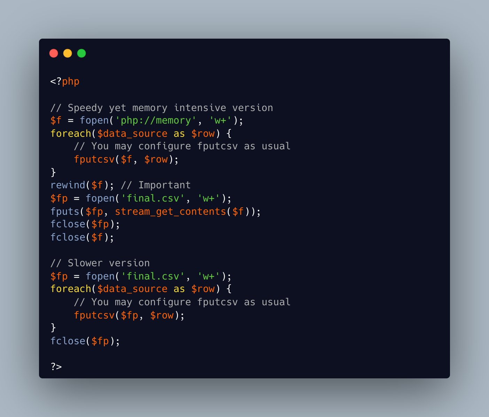

.. _speed-up-csv-write-to-disk:

Speed Up CSV Write To Disk
--------------------------

.. meta::
	:description:
		Speed Up CSV Write To Disk: When writing CSV files with fputcsv() function, PHP flushes each row to the disk.
	:twitter:card: summary_large_image
	:twitter:site: @exakat
	:twitter:title: Speed Up CSV Write To Disk
	:twitter:description: Speed Up CSV Write To Disk: When writing CSV files with fputcsv() function, PHP flushes each row to the disk
	:twitter:creator: @exakat
	:twitter:image:src: https://php-tips.readthedocs.io/en/latest/_images/speed_up_write_to_disk.png
	:og:image: https://php-tips.readthedocs.io/en/latest/_images/speed_up_write_to_disk.png
	:og:title: Speed Up CSV Write To Disk
	:og:type: article
	:og:description: When writing CSV files with fputcsv() function, PHP flushes each row to the disk
	:og:url: https://php-tips.readthedocs.io/en/latest/tips/speed_up_write_to_disk.html
	:og:locale: en

.. raw:: html

	

When writing CSV files with fputcsv() function, PHP flushes each row to the disk. To speed up the process, it is possible to open a file in memory, with the ``php://memory`` wrapper, and write the CSV there. Then, it is possible to write down from memory down to the disk in one batch, saving a lot of disks flushes.

The same trick may be used to write any kind of files: write it quickly, in memory, and then, down to the disk in one batch.

See Also
________

* `fputcsv <https://www.php.net/manual/en/function.fputcsv.php>`_
* `fputcsv() in loops <https://exakat.readthedocs.io/en/latest/Reference/Rules/Performances/CsvInLoops.html#fputcsv-in-loops>`_
* `fputcsv in loops <https://3v4l.org/8ei2U>`_ [Try me]

PHP Features
____________

* `memory <https://php-dictionary.readthedocs.io/en/latest/dictionary/memory.ini.html>`_

* `optimisation <https://php-dictionary.readthedocs.io/en/latest/dictionary/optimisation.ini.html>`_

* `csv <https://php-dictionary.readthedocs.io/en/latest/dictionary/csv.ini.html>`_

* `file <https://php-dictionary.readthedocs.io/en/latest/dictionary/file.ini.html>`_

