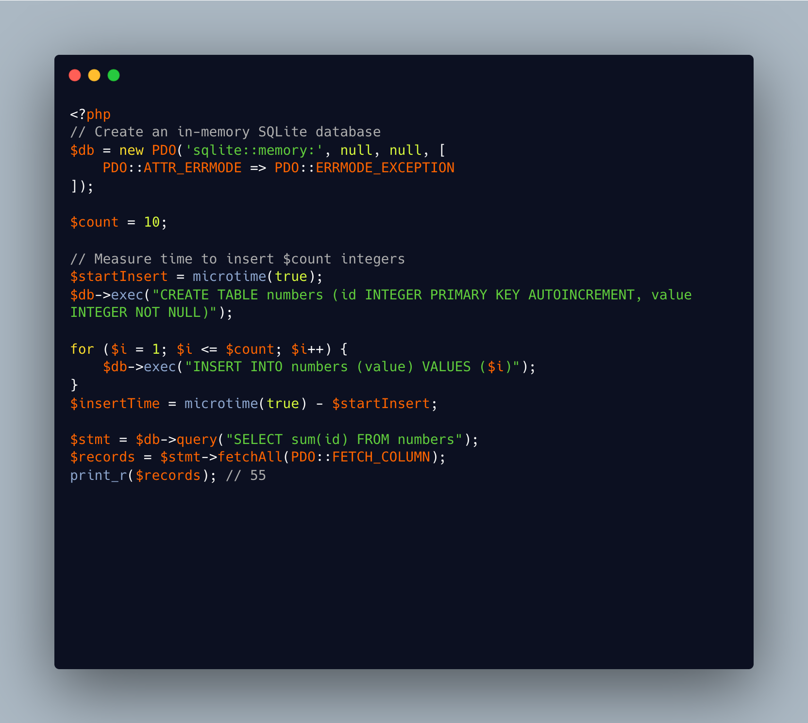

.. _sql-in-memory:

SQL In Memory
-------------

.. meta::
	:description:
		SQL In Memory: There is no need to set up a whole SQL server to run queries.
	:twitter:card: summary_large_image
	:twitter:site: @exakat
	:twitter:title: SQL In Memory
	:twitter:description: SQL In Memory: There is no need to set up a whole SQL server to run queries
	:twitter:creator: @exakat
	:twitter:image:src: https://php-tips.readthedocs.io/en/latest/_images/sql_memory.png
	:og:image: https://php-tips.readthedocs.io/en/latest/_images/sql_memory.png
	:og:title: SQL In Memory
	:og:type: article
	:og:description: There is no need to set up a whole SQL server to run queries
	:og:url: https://php-tips.readthedocs.io/en/latest/tips/sql_memory.html
	:og:locale: en

.. raw:: html

	

There is no need to set up a whole SQL server to run queries. When the dataset is small enough, but the processing is complex enough, it may be worth starting a SQLITE database in PHP memory, and run the queries there.

There is also a temporary database, which is created with no filename: PHP create a file for this, and removes it at the end of the execution.

Performances are usually much lower than using arrays, but complexity and standard usage may be worth the extra work.

See Also
________

* `sqlite3 in memory <https://3v4l.org/VkfuV#v8.5.7>`_ [Try me]

PHP Features
____________

* `sqlite3 <https://php-dictionary.readthedocs.io/en/latest/dictionary/sqlite3.ini.html>`_

* `temporary <https://php-dictionary.readthedocs.io/en/latest/dictionary/temporary.ini.html>`_

* `memory <https://php-dictionary.readthedocs.io/en/latest/dictionary/memory.ini.html>`_

