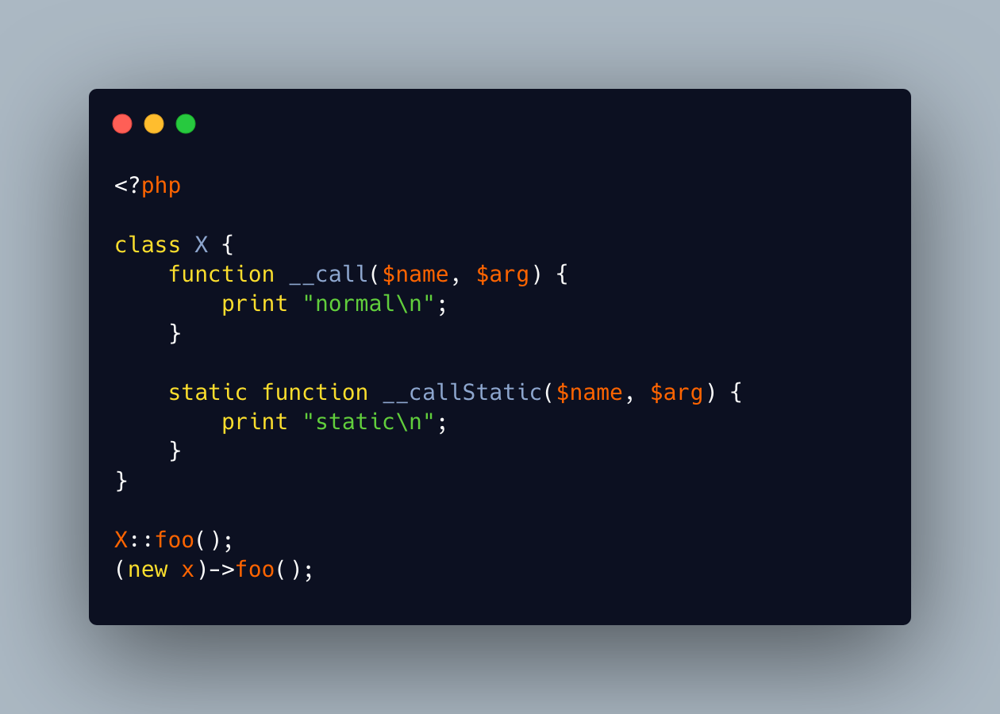

.. _static-and-not-static-method:

Static And Not Static Method
----------------------------

.. meta::
	:description:
		Static And Not Static Method: Could PHP have both a static and a non-static method, with the same name.
	:twitter:card: summary_large_image
	:twitter:site: @exakat
	:twitter:title: Static And Not Static Method
	:twitter:description: Static And Not Static Method: Could PHP have both a static and a non-static method, with the same name
	:twitter:creator: @exakat
	:twitter:image:src: https://php-tips.readthedocs.io/en/latest/_images/static_and_not_static.png
	:og:image: https://php-tips.readthedocs.io/en/latest/_images/static_and_not_static.png
	:og:title: Static And Not Static Method
	:og:type: article
	:og:description: Could PHP have both a static and a non-static method, with the same name
	:og:url: https://php-tips.readthedocs.io/en/latest/tips/static_and_not_static.html
	:og:locale: en

.. raw:: html

	

Could PHP have both a static and a non-static method, with the same name?

PHP accepts to have several signatures for the same method, yet this has to be handled with different tools, in the body of the function.

On the other hand, since methods must have a unique name, it must be either static or non-static.

To support both static and non-static method calls, the first step is to... remove the methods with the target name: PHP always uses the available method first.

Then, replace them with two calls to magic methods: ``__call`` and ``__callStatic``. These two magic methods are called depending on the style of the call: static or not static.

While this is a rather academic question, it might be a useful feature when migrating from a static class to a normal one, while keeping backward compatible syntax.

See Also
________

* `Same method, different static <https://3v4l.org/qCGKn0>`_ [Try me]

PHP Features
____________

* `static <https://php-dictionary.readthedocs.io/en/latest/dictionary/static.ini.html>`_

* `non-static <https://php-dictionary.readthedocs.io/en/latest/dictionary/non-static.ini.html>`_

* `backward-incompatible <https://php-dictionary.readthedocs.io/en/latest/dictionary/backward-incompatible.ini.html>`_

* `method <https://php-dictionary.readthedocs.io/en/latest/dictionary/method.ini.html>`_

