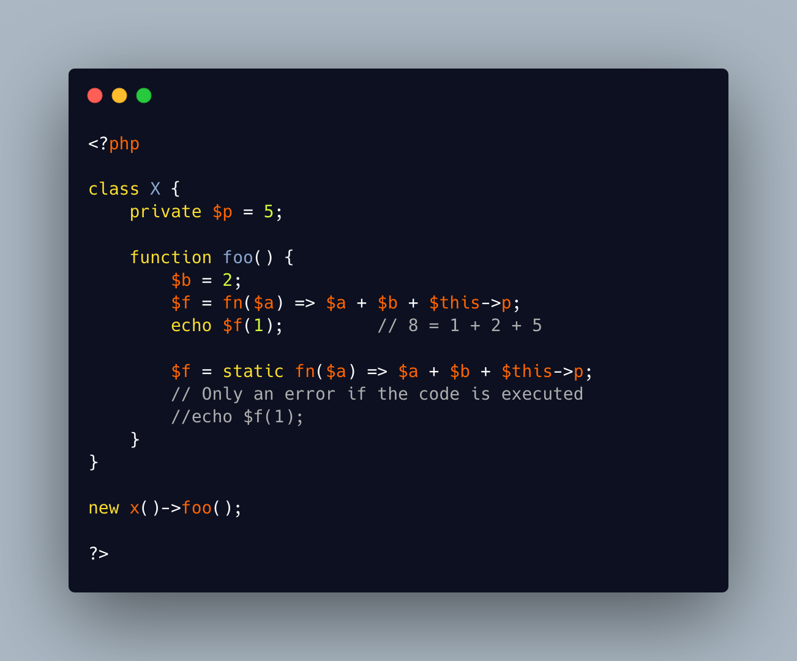

.. _static-arrow-function:

Static Arrow Function
---------------------

.. meta::
	:description:
		Static Arrow Function: It is possible to add the ``static`` option to an arrow function.
	:twitter:card: summary_large_image
	:twitter:site: @exakat
	:twitter:title: Static Arrow Function
	:twitter:description: Static Arrow Function: It is possible to add the ``static`` option to an arrow function
	:twitter:creator: @exakat
	:twitter:image:src: https://php-tips.readthedocs.io/en/latest/_images/static_arrow_function.png
	:og:image: https://php-tips.readthedocs.io/en/latest/_images/static_arrow_function.png
	:og:title: Static Arrow Function
	:og:type: article
	:og:description: It is possible to add the ``static`` option to an arrow function
	:og:url: https://php-tips.readthedocs.io/en/latest/tips/static_arrow_function.html
	:og:locale: en

.. raw:: html

	

It is possible to add the ``static`` option to an arrow function. In that case, PHP doesn't allow usage of the local object context, via ``$this``.

On the other hand, it is still possible to access all the local variables of the context, and, if ever, ``$this`` was assigned to a local variable, it may be imported in the arrow function context.

Also, note that PHP accepts the presence of ``$this`` in the static arrow function, as long as... it is not executed! Since there is no way to modify the static status of the arrow function, it is a zombie function: it may be passed around, but not executed.

See Also
________

* `Static closure, or not <https://3v4l.org/aXec4#veol>`_ [Try me]

PHP Error Messages
__________________

* `Using $this when not in object context <https://php-errors.readthedocs.io/en/latest/messages/using-%24this-when-not-in-object-context.html>`_

PHP Features
____________

* `static <https://php-dictionary.readthedocs.io/en/latest/dictionary/static.ini.html>`_

* `arrow-function <https://php-dictionary.readthedocs.io/en/latest/dictionary/arrow-function.ini.html>`_

* `closure <https://php-dictionary.readthedocs.io/en/latest/dictionary/closure.ini.html>`_

* `$this <https://php-dictionary.readthedocs.io/en/latest/dictionary/%24this.ini.html>`_

